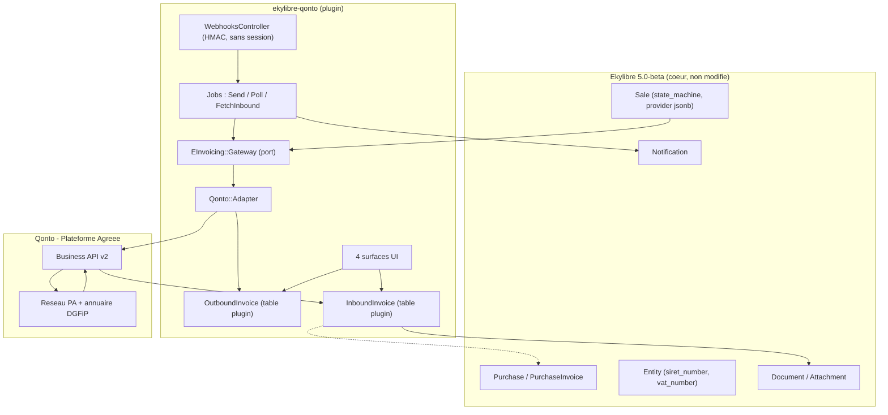
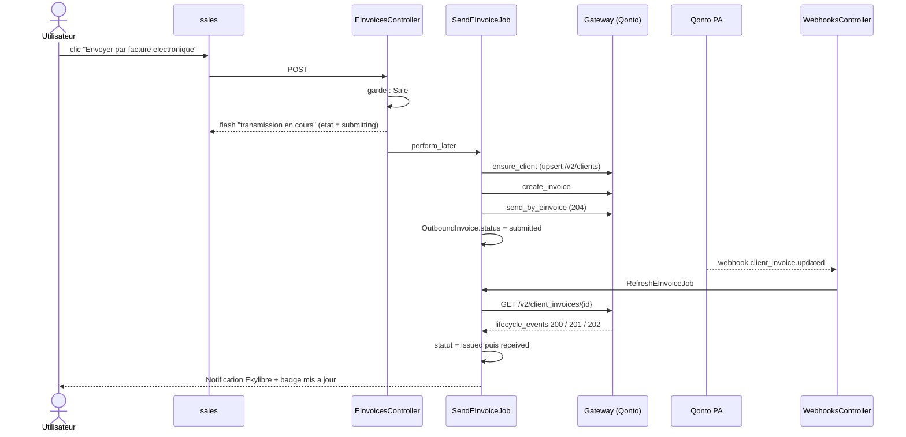
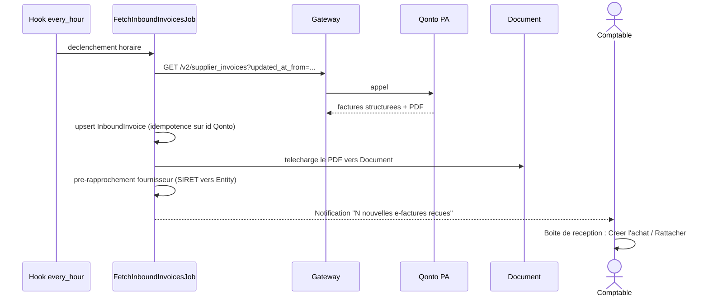
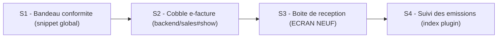
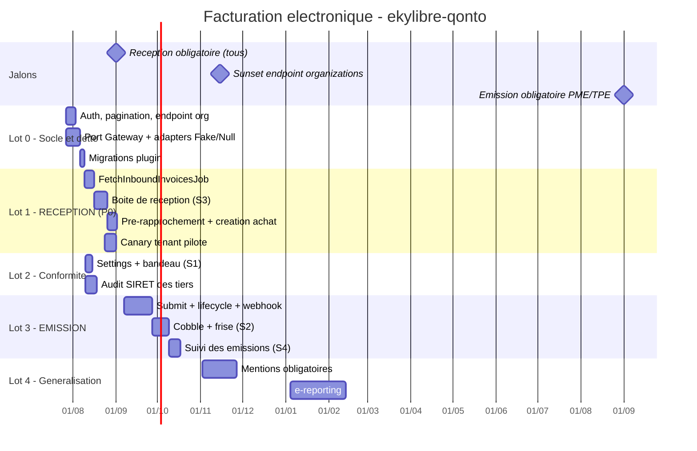

# Facturation électronique dans `ekylibre-qonto`

**Cible :** Ekylibre `5.0-beta` (commit `08fcabe`, 20/07/2026) — plugin `ekylibre/ekylibre-qonto` (branche `main`, seule branche existante)
**Date :** 26 juillet 2026 — **J-37 avant le 1ᵉʳ septembre 2026**
**Statut :** proposition d'architecture + conception UI

---

## 0. TL;DR — les 6 décisions

| # | Décision | Justification courte |
|---|---|---|
| D1 | **Qonto = Plateforme Agréée (PA), Ekylibre ne génère pas de Factur-X conforme lui-même** | Le pipeline d'impression est Jasper/`beardley` (RJB → Java) : il produit du PDF, pas du PDF/A-3. Fabriquer un Factur-X conforme en interne = Ghostscript + contraintes Ruby 2.6 + validation Schematron. Coût sans rapport avec le gain. |
| D2 | **Priorité absolue à la RÉCEPTION, pas à l'émission** | Le 01/09/2026 impose la *réception* à 100 % des assujettis. L'émission n'est obligatoire pour les TPE/PME (= la base installée Ekylibre) qu'au **01/09/2027**. |
| D3 | **Port / adapter `EInvoicing::Gateway`, Qonto = une implémentation** | L'API Qonto ne suit **pas** AFNOR XP Z12-013 (assumé par Qonto dans sa doc). Sans abstraction, le lock-in est total et un changement de PA = réécriture. |
| D4 | **Aucun nouveau framework front. Sprockets + Bootstrap 3 + jQuery + progressive enhancement** | Vérifié : les assets de plugin passent par Sprockets (`tmp/plugins/assets`), pas Webpacker. Et `vue` n'est **pas** dans `package.json` (seuls `vue-chartjs` et `vuedraggable` traînent). |
| D5 | **0 nouveau « module e-facturation ». 4 surfaces greffées sur l'existant** | Les points d'extension (`:main_toolbar`, `:cobbler`, `extensions_*`, snippets) permettent d'injecter la conformité *dans* le flux de travail plutôt qu'à côté. |
| D6 | **Webhook (signal) + polling (filet de sécurité), jamais l'un seul** | Le `204` de `send_by_einvoice` ne signifie **pas** « envoyé ». Le webhook `v1/client-invoices` porte `einvoicing_status` mais **pas** `einvoicing_lifecycle_events`. |

---

## 1. Contexte réglementaire — ce qui compte pour Ekylibre

Architecture définitivement stabilisée (loi de finances 2026) : **abandon du PPF comme plateforme d'échange**, recours obligatoire aux **Plateformes Agréées (PA, ex-PDP)**, l'État ne conservant que l'annuaire et le concentrateur.

| Échéance | Obligation | Impact Ekylibre |
|---|---|---|
| **01/09/2026** | **Réception** e-facture obligatoire — *toutes* les entreprises assujetties, y compris micro | ⚠️ **Critique.** Chaque exploitation cliente doit être raccordée à une PA et capable de recevoir. |
| 01/09/2026 | Émission + e-reporting pour GE/ETI | Marginal (peu de GE/ETI dans la base). |
| **01/09/2027** | Émission + e-reporting pour PME/TPE/micro | ⏳ **La vraie échéance émission d'Ekylibre.** 13 mois de marge. |

Sanctions : ~500 € pour absence de PA au 01/09/2026 (puis 1 000 € par trimestre), 15 €/facture non conforme (plafond 15 000 €/an), 250 € par manquement e-reporting.

> **Conséquence produit :** l'écran qui doit exister le 1ᵉʳ septembre est une **boîte de réception de factures fournisseurs**, pas un bouton « envoyer par e-facture ». C'est contre-intuitif et c'est le point le plus important de ce document.

---

## 2. État des lieux vérifié

### 2.1 Le plugin actuel (16 fichiers)

```
app/integrations/qonto/qonto_integration.rb          ActionIntegration::Base, 3 méthodes
app/controllers/qonto/qonto_synchronizations_controller.rb
app/jobs/qonto/fetch_transactions_job.rb
app/services/qonto/transactions_import_service.rb    → BankStatement / BankStatementItem
app/services/qonto/documents_import_service.rb       → Document + attachments
app/views/backend/cashes/_sync_qonto_bank_account_toolbar.html.haml
config/routes.rb, config/locales/{eng,fra}/action.yml
lib/ekylibre-qonto/engine.rb                         Rails::Engine (pas le DSL Ekylibre::Plugin)
```

Périmètre fonctionnel : **relevés bancaires + pièces jointes uniquement**. Zéro modèle, zéro migration, un seul addon de toolbar.

### 2.2 Dette à purger dans le même lot (constats de lecture de code)

| Sévérité | Constat | Fichier |
|---|---|---|
| 🔴 **Bloquant daté** | `check` appelle `GET /v2/organizations/{client_id}` — endpoint **déprécié, sunset le 15/11/2026**. Le paramètre passé est le `client_id`, pas le `slug`. | `qonto_integration.rb:29` |
| 🔴 | `list_transactions` ne gère **aucune pagination** — l'API Qonto pagine ; au-delà de la première page, perte silencieuse de données. | `qonto_integration.rb:38` |
| 🟠 | `DocumentsImportService#call` **ignore son argument `cash`** et itère sur *tous* les `BankStatementItem` de provider `qonto` du tenant à chaque synchro. Complexité croissante sans borne. | `documents_import_service.rb:52` |
| 🟠 | `bank_statement_item_already_exists?` teste `item.transaction_number`, champ inexistant dans la payload Qonto (`transaction_id`). Test mort → l'idempotence repose entièrement sur `of_provider`. | `transactions_import_service.rb:105` |
| 🟡 | `integration = fetch integration` : la variable locale vaut `nil` à l'évaluation. Fonctionne par accident (`fetch(nil)` retombe sur `integration_name`). | ×3 |
| 🟡 | `puts ... .green` en production, `rescue StandardError` avalant tout. | partout |
| 🟡 | README documente **Nordigen**, pas Qonto. | `README.md` |

> Ces points ne sont pas cosmétiques : **le sunset du 15/11/2026 tombe 10 semaines après l'échéance réglementaire**. Traiter les deux dans un seul lot.

### 2.3 Contraintes du cœur `5.0-beta` (vérifiées)

| Domaine | Réalité |
|---|---|
| Runtime | Ruby `>= 2.6.6, < 3.0` · Rails `5.2.8.1` |
| Front | `bootstrap-sass ~> 3.4.1`, `jquery-rails ~> 4.4`, `turbolinks ~> 5.2.1`, `webpacker ~> 4.x`, TypeScript 4 — **pas de Vue, pas de Hotwire/Turbo, pas de Stimulus** |
| Vues | HAML + helpers maison : `main_toolbar`, `main_state_bar`, `main_informations`, `attributes_list`, `cobbles` / `cobble_list`, `tool_to` |
| Extension | `Ekylibre::View::Addon` → contextes `:main_toolbar`, `:cobbler`, `extensions_<place>` · DSL `Ekylibre::Plugin` : `add_toolbar_addon`, `add_cobble_addon`, `snippet`, `add_routes`, `require_javascript`, `subscribe` |
| Assets plugin | **Sprockets** (miroir `tmp/plugins/assets/`) — Webpacker inaccessible depuis un plugin |
| Ordonnancement | `ActionIntegration::Base.run(every: :hour \| :day)` → s'abonne aux hooks `every_hour` / `every_day` |
| Persistance ext. | Concern `Providable` + colonne `provider` (jsonb). **`Sale` l'a. `Purchase` / `PurchaseInvoice` ne l'ont pas.** |
| Multi-tenant | Apartment, elevator **par sous-domaine** → une URL de webhook par tenant est naturelle |
| Impression | Jasper via `beardley` / `rjb` + `DocumentTemplate` (nature `sales_invoice`) → **PDF simple, pas PDF/A-3** |

### 2.4 API Qonto e-invoicing (vérifiée sur `docs.qonto.com`)

```
GET  /v2/einvoicing/settings          → { sending_status, receiving_status }
                                        receiving_status ∈ enabled | disabled
                                                          | pending_creation | pending_deletion
GET  /v2/clients                      → champ e_invoicing_reachable (bool)  ← préalable obligatoire
POST /v2/client_invoices              → création (ou /v2/client_invoice_uploads pour Factur-X externe)
POST /v2/client_invoices/{id}/send_by_einvoice
                                      → 204 = ACCEPTÉ POUR TRAITEMENT (≠ envoyé)
                                      → 412 : recipient_not_reachable_on_einvoicing,
                                              invoice_not_in_draft_status, ...
GET  /v2/client_invoices/{id}         → einvoicing_status + einvoicing_lifecycle_events[]
                                        status_code : 200 Déposée · 201 Émise · 202 Reçue
GET  /v2/supplier_invoices            → RÉCEPTION
webhook v1/client-invoices (created / updated) : porte einvoicing_status,
                                                 PAS le tableau lifecycle → signal de re-fetch
```

> 🔴 **Contrainte majeure de qualité : l'e-invoicing n'existe qu'en PRODUCTION.** Le sandbox Qonto ne le supporte pas (le réseau n'existe qu'en prod). Aucun test d'intégration bout-en-bout n'est possible avant mise en production réelle. → cf. §8.

---

## 3. Architecture cible

### 3.1 Vue composants



### 3.2 Séquence — émission (lot 3, échéance 09/2027)



### 3.3 Séquence — réception (lot 1, échéance 09/2026)



---

## 4. Modèle de données

Les migrations doivent se faire obligatoirement dans ekylibre, jamais dans les plugins.

```ruby
# db/migrate/20260801000001_create_qonto_einvoices.rb
create_table :qonto_outbound_invoices do |t|
  t.references :sale, foreign_key: true, index: { unique: true }
  t.string   :remote_id, null: false, index: { unique: true }  # client_invoice_id Qonto
  t.string   :status,    null: false, default: 'pending'
  t.string   :remote_status                                    # einvoicing_status brut
  t.jsonb    :lifecycle_events, null: false, default: []       # miroir horodaté
  t.jsonb    :last_error,       null: false, default: {}       # { code:, detail:, at: }
  t.datetime :submitted_at, :issued_at, :received_at, :last_polled_at
  t.integer  :poll_attempts, null: false, default: 0
  t.timestamps
end

create_table :qonto_inbound_invoices do |t|
  t.string   :remote_id, null: false, index: { unique: true }
  t.string   :status,    null: false, default: 'to_review'     # to_review|matched|ignored
  t.string   :supplier_name, :supplier_siret, :invoice_number, :currency
  t.decimal  :amount, :pretax_amount, precision: 19, scale: 4
  t.date     :issued_on, :due_on
  t.references :entity,   foreign_key: true          # fournisseur deviné
  t.references :purchase, foreign_key: true          # achat créé
  t.references :document, foreign_key: true          # PDF / Factur-X
  t.jsonb    :payload, null: false, default: {}      # brut, pour rejouabilité
  t.timestamps
end
```

**Pourquoi des tables dédiées plutôt que `Sale#provider` ?**
`provider` (jsonb) est parfait pour un identifiant externe. Il est inadapté ici : on a besoin d'indexer par statut (« montre-moi les factures bloquées »), de compter les tentatives de polling, et surtout de **conserver une piste d'audit** — la conformité fiscale se prouve. Côté réception, `Purchase` n'a de toute façon **pas** de colonne `provider`.

---

## 5. Le port : ne pas se marier avec Qonto

```ruby
# app/services/e_invoicing/gateway.rb  (interface)
module EInvoicing
  class Gateway
    Result = Struct.new(:ok?, :value, :error_code, :error_detail, keyword_init: true)

    def connection_status; end                    # → :enabled | :disabled | :pending | :unavailable
    def recipient_reachable?(entity); end         # → true | false | :unknown
    def submit(sale); end                         # → Result(remote_id)
    def lifecycle(remote_id); end                 # → [{ code:, label:, occurred_at: }]
    def inbound_since(datetime); end              # → [Hash]
  end
end
```

Trois implémentations :

| Implémentation | Usage |
|---|---|
| `EInvoicing::Adapters::Qonto` | production |
| `EInvoicing::Adapters::Null` | tenant sans intégration → l'UI dégrade proprement au lieu de crasher |
| `EInvoicing::Adapters::Fake` | **tests + recette**, puisque le sandbox Qonto ne fait pas d'e-invoicing (§8) |

Le vocabulaire du port est **réglementaire** (`submit`, `issued`, `received`), pas Qonto. Le jour où une autre PA arrive (ou si Qonto s'aligne sur AFNOR XP Z12-013), seul l'adapter bouge.

---

## 6. Conception UI — le cœur du sujet

### 6.1 Cinq principes

1. **La conformité est invisible quand tout va bien, impossible à rater quand ça casse.** Un badge discret en régime nominal ; un bandeau persistant + une notification quand le raccordement manque ou qu'une facture est rejetée.
2. **Un seul bouton, trois états — jamais un choix technique posé à l'agriculteur.** On ne demande pas « email ou e-facture ? ». Le système tranche selon `e_invoicing_reachable`, et **affiche pourquoi**.
3. **Rendre l'asynchrone lisible.** Un `204` ne veut rien dire pour un utilisateur. Ne jamais afficher « Envoyée » sur un `204` : afficher « Transmission en cours », puis faire progresser une frise.
4. **Traduire, jamais transcrire.** `recipient_not_reachable_on_einvoicing` → « Ce client n'est pas encore raccordé à une plateforme agréée. La facture a été envoyée par email. »
5. **Toujours une porte de sortie.** Le repli email et le téléchargement PDF restent accessibles en permanence.

### 6.2 Cartographie : 4 surfaces, 1 seul écran neuf



---

### S1 — Bandeau de raccordement (`snippet` / `extensions_*`)

**Quand :** `connection_status != :enabled`.
**Où :** snippet latéral + alerte en tête de `backend/sales#index` et `backend/purchases#index`.

```haml
-# app/views/qonto/_einvoicing_banner.html.haml
- status = Qonto::EInvoicingSettings.cached
- if status.receiving_disabled?
  .alert.alert-danger
    %strong= :einvoicing_not_connected.tl
    %p= :einvoicing_reception_mandatory_on.tl(date: '01/09/2026', days: (Date.new(2026, 9, 1) - Date.today).to_i)
    = link_to :einvoicing_activate.tl, 'https://qonto.com/...', class: 'btn btn-primary btn-sm', target: '_blank'
- elsif status.pending_creation?
  .alert.alert-info
    = :einvoicing_activation_pending.tl
```

Détails qui comptent :
- **compte à rebours en jours** — plus mobilisateur qu'une date ;
- `pending_creation` a son propre message : ne pas alarmer un utilisateur qui a déjà fait le nécessaire ;
- valeur **mise en cache** (`Rails.cache`, 1 h) et rafraîchie par le job horaire — jamais d'appel HTTP synchrone dans le rendu d'une vue.

---

### S2 — Cobble « Facturation électronique » sur `backend/sales#show`

C'est la surface la plus visible. Elle utilise le contexte `:cobbler`, avec condition `to: 'backend/sales#show'`.

```ruby
# lib/ekylibre-qonto/engine.rb
initializer 'ekylibre-qonto.einvoicing_addons' do
  Ekylibre::View::Addon.add(:cobbler, 'qonto/einvoicing_cobble', to: 'backend/sales#show')
  Ekylibre::View::Addon.add(:main_toolbar, 'qonto/einvoicing_toolbar', to: 'backend/sales#show')
end
```

#### a) Le bouton unique, trois états (`main_toolbar`)

| Condition | Rendu |
|---|---|
| `sale.invoice?` && client joignable && jamais soumise | **bouton actif** « Envoyer par facture électronique » |
| soumise, non terminée | **bouton désactivé** « Transmission en cours… » + spinner |
| terminée (`received`) | **pas de bouton** — statut dans le cobble |
| client non joignable | **bouton désactivé** + `title` explicatif + lien « Envoyer par email » |

```haml
-# app/views/qonto/_einvoicing_toolbar.html.haml
- ei = Qonto::OutboundInvoice.find_by(sale: resource)
- reachable = Qonto::Reachability.for(resource.client)
- if resource.invoice?
  - if ei.nil? && reachable
    = tool_to :send_by_einvoice.tl, qonto_sale_einvoice_path(resource), method: :post, tool: :send
  - elsif ei&.in_progress?
    = tool_to :einvoice_in_progress.tl, '#', disabled: true, tool: :clock
  - elsif !reachable
    = tool_to :send_by_einvoice.tl, '#', disabled: true, tool: :send,
              title: :client_not_reachable_on_einvoicing.tl
```

#### b) La frise de cycle de vie

L'objet central. `list-group` Bootstrap 3, pas de composant exotique.

```haml
-# app/views/qonto/_einvoicing_cobble.html.haml
- return unless resource.invoice?
- ei = Qonto::OutboundInvoice.find_by(sale: resource)
- c.cobble :einvoicing, title: :electronic_invoicing.tl, position: 150 do
  - if ei.nil?
    %p.text-muted= :einvoice_not_submitted_yet.tl
  - else
    %ul.list-group.einvoicing-timeline{ data: { poll_url: status_qonto_einvoice_path(ei),
                                                poll: ei.in_progress? } }
      - Qonto::OutboundInvoice::STEPS.each do |step|
        - event = ei.event_for(step)
        -# classe : done / current / pending / failed
        %li.list-group-item{ class: ei.step_class(step) }
          %span.badge= event&.occurred_at&.l(format: :hour_minute)
          %span.step-icon
          = step_label(step).tl
          - if event&.detail
            %small.text-muted= event.detail
    - if ei.failed?
      .alert.alert-warning
        = Qonto::ErrorTranslator.human(ei.last_error['code'])
        = link_to :send_by_email_instead.tl, email_client_backend_sale_path(resource), class: 'btn btn-default btn-xs'
    %p
      = link_to :download_facturx.tl, facturx_qonto_einvoice_path(ei), class: 'btn btn-default btn-xs'
```

**Vocabulaire affiché** — traduction des `status_code` :

| Code Qonto | Libellé Ekylibre | Sous-titre |
|---|---|---|
| — | Préparation | Contrôle des mentions obligatoires |
| `200` | **Déposée** | Reçue par votre plateforme agréée |
| `201` | **Émise** | Transmise sur le réseau national |
| `202` | **Reçue** | La plateforme de votre client a accusé réception |

#### c) Rafraîchissement sans framework

Progressive enhancement, en Sprockets, ES5-compatible, réconcilié avec Turbolinks :

```javascript
// app/assets/javascripts/plugins/qonto/einvoicing.js
(function ($) {
  'use strict';
  var timer = null;

  function stop() { if (timer) { clearInterval(timer); timer = null; } }

  function poll($el) {
    $.getJSON($el.data('poll-url'), function (data) {
      $el.replaceWith(data.html);            // fragment rendu côté serveur
      if (!data.in_progress) { stop(); }
    });
  }

  function start() {
    var $el = $('.einvoicing-timeline[data-poll="true"]');
    if (!$el.length) { return; }
    timer = setInterval(function () { poll($el); }, 15000);
  }

  $(document).on('turbolinks:load', start);
  $(document).on('turbolinks:before-cache', stop);   // indispensable, sinon fuite de timer
})(jQuery);
```

Le serveur renvoie du **HTML déjà rendu** (`render_to_string` de la partial) : une seule source de vérité pour le gabarit, pas de duplication de logique de présentation en JS. C'est du « HTML over the wire » manuel — l'esprit de Hotwire, sans la dépendance impossible en Rails 5.2.

Complément : une **notification Ekylibre** (`user.notifications.create!`) à l'état terminal, pour l'utilisateur qui a quitté la page.

---

### S3 — Boîte de réception des e-factures fournisseurs — **le seul écran neuf, et le plus urgent**

Contrôleur du plugin héritant de `Backend::BaseController`, entrée de menu via `extend_navigation`.

**Structure** — trois zones :

```
┌──────────────────────────────────────────────────────────────────────┐
│  [ À traiter (12) ] [ Rapprochées (340) ] [ Ignorées ]     🔄 Sync.   │
├──────────────────────────────────────────────────────────────────────┤
│ ▸ 12/07  CAVAC          FA-2026-1187   4 820,00 €  ✓ fournisseur     │
│                                                    [Créer l'achat]   │
│ ▸ 11/07  Terrena        F26-99021      1 204,50 €  ⚠ inconnu         │
│                                                    [Associer…]       │
└──────────────────────────────────────────────────────────────────────┘
```

Choix de conception :

- **Onglets par statut** (`nav nav-tabs`), pas de filtre à construire. L'onglet « À traiter » porte un compteur : c'est la métrique de conformité vécue.
- **Pré-rapprochement automatique** sur `siret_number` → `Entity`. Quand ça matche, badge vert ; sinon un champ `unroll` (l'autocomplete natif Ekylibre) pour rattacher, avec option « créer le tiers ».
- **Ligne dépliable** (`collapse` BS3) : détail des lignes structurées + aperçu du PDF. On évite un écran `show` supplémentaire.
- **Action primaire unique par ligne** : « Créer l'achat ». Elle pré-remplit `backend/purchase_invoices/new` avec les données structurées — la valeur réelle de l'e-facture, c'est **la saisie qui disparaît**. C'est l'argument de vente interne du chantier.
- **Idempotence visible** : un import déjà rapproché affiche un lien vers le `Purchase` créé. Jamais de doublon silencieux.

> Cet écran justifie à lui seul le chantier auprès des utilisateurs : sans lui, la réforme n'est qu'une contrainte ; avec lui, c'est de la ressaisie en moins.

---

### S4 — Suivi des émissions

Index simple du plugin, filtré par statut, avec une seule question à laquelle il doit répondre : **« qu'est-ce qui est bloqué ? »**

- tri par défaut : `failed` d'abord, puis `in_progress` les plus anciennes ;
- action de masse : « Relancer les échecs » ;
- export CSV pour l'expert-comptable ;
- alerte sur les factures `submitted` depuis > 48 h sans passage à `issued` — la dérive silencieuse de la PA est le cas le plus pernicieux, personne ne la voit sans ce garde-fou.

---

### 6.3 Ce qu'il ne faut **pas** faire

| Anti-pattern | Pourquoi |
|---|---|
| Une entrée de menu « Facturation électronique » avec sous-menus | Crée un silo. La conformité doit vivre dans le flux facture/achat existant. |
| Afficher « Envoyée ✅ » sur le `204` | Faux, et juridiquement trompeur. |
| Exposer `einvoicing_status` brut | Jargon d'API dans une UI d'exploitation agricole. |
| Introduire Vue/React « pour la timeline » | `vue` n'est pas installé, et les assets de plugin passent par Sprockets. Coût d'intégration >> gain. |
| Bloquer la validation d'une facture si le client n'est pas joignable | La loi impose de transmettre, pas d'empêcher de facturer. Le repli email doit rester fluide. |
| Un modal de confirmation avant l'envoi | Ajoute un clic sans réduire le risque : l'action reste rattrapable par avoir ou relance. |

---

## 7. Prérequis données (indépendants de Qonto — à lancer immédiatement)

Ces points bloquent la conformité **quelle que soit** la PA retenue :

1. **SIRET du client** — `Entity#siret_number` existe et est validé au format français, mais reste **facultatif**. Il devient la clé de routage dans l'annuaire. → écran d'audit « tiers sans SIRET » + enrichissement de masse.
2. **Nouvelles mentions obligatoires** (4) : SIREN du client, adresse de livraison, **catégorie d'opération (biens / services / mixte)**, option TVA sur les débits. → `Sale` porte `delivery_address_id` mais **pas** la catégorie d'opération. Migration cœur ou `custom_fields` : à arbitrer.
3. **Cache de joignabilité** : synchroniser `e_invoicing_reachable` depuis `GET /v2/clients` vers `Entity#provider` (`Providable` est déjà inclus dans `Entity`) — évite un appel API par ligne de liste.

> Sans le point 1, rien ne part. À planifier en parallèle du développement, pas après.

---

## 8. Stratégie de test — contrainte forte

**L'e-invoicing Qonto n'existe pas en sandbox.** Conséquences concrètes :

| Niveau | Approche |
|---|---|
| Unitaire | `EInvoicing::Adapters::Fake` — machine à états déterministe reproduisant `200 → 201 → 202`, plus les chemins d'échec (`412 recipient_not_reachable`, timeout, webhook hors séquence, événements en désordre). |
| Contrat | Fixtures figées issues de l'OpenAPI Qonto (`openapi_v2.yml`), rejouées via VCR/WebMock. Un test qui **échoue si le schéma dérive**. |
| Intégration | Sandbox Qonto pour tout le **non-e-invoicing** (clients, factures, pièces jointes, transactions). |
| Bout-en-bout | **Impossible avant la prod.** → prévoir un *canary* : 1 tenant pilote, 1 client réel, feature flag par tenant, log dédié, et rétention de la payload brute (`payload` jsonb) pour rejouabilité. |
| Non-régression | Le sunset du 15/11/2026 sur `/v2/organizations/{slug}` doit être couvert par un test qui échoue si l'ancien appel subsiste. |

Le **feature flag par tenant** n'est pas optionnel : c'est le seul moyen de dérisquer une mise en production sans recette bout-en-bout.

---

## 9. Lotissement



**Chemin critique :** Lot 0 → Lot 1 → canary avant le 01/09/2026. Tout le reste peut glisser.

---

## 10. Points d'arbitrage à trancher

1. **API key vs OAuth2.** Les endpoints e-invoicing acceptent les deux (`SecretKey` figure dans le schéma de sécurité). L'API key est le chemin le plus court et conserve `ActionIntegration` tel quel. OAuth2 est plus propre pour un ERP distribué (consentement, révocation, refresh) mais `ActionIntegration` **ne sait pas faire d'OAuth aujourd'hui** — c'est un chantier à part entière. → *Recommandation : API key pour les lots 0-2, OAuth2 en lot 4.*
2. **Webhook et multi-tenant.** L'elevator Apartment est par sous-domaine : une souscription webhook par tenant vers `https://<tenant>.<domaine>/qonto/webhooks` fonctionne nativement. Reste à décider qui la crée (à l'activation de l'intégration) et à vérifier la signature HMAC hors session/CSRF.
3. **Factur-X : produit par Qonto ou par Ekylibre ?** D1 tranche pour Qonto. Si un besoin d'archivage légal en PDF/A-3 côté Ekylibre émerge, il devra passer par un service externalisé — **pas** par Jasper.
4. **`ekylibre-qonto` doit-il rester un `Rails::Engine` nu ou adopter le DSL `Ekylibre::Plugin` ?** Le DSL donne `add_cobble_addon`, `snippet`, `extend_navigation`, `require_javascript` — tous nécessaires ici. → *migrer vers le DSL en lot 0.*
5. **Branche.** Le plugin n'a **que** `main`. Créer une branche `5.0-beta` alignée sur le cœur, ou versionner par gemspec ? À trancher avant le premier commit.

---

## Annexe — traduction des erreurs

| Code Qonto | Message utilisateur (fr) | Action proposée |
|---|---|---|
| `recipient_not_reachable_on_einvoicing` | « Ce client n'est pas encore raccordé à une plateforme agréée. » | Envoyer par email |
| `invoice_not_in_draft_status` | « Cette facture a déjà été transmise. » | Consulter le suivi |
| `forbidden_invoice_update` | « Cette facture ne peut plus être modifiée après transmission. » | Émettre un avoir |
| `412` autre | « La plateforme a refusé la facture : contrôlez les mentions obligatoires. » | Ouvrir le contrôle des mentions |
| `401` / `403` | « La connexion à Qonto a expiré. » | Reconfigurer l'intégration |
| timeout / `5xx` | « Plateforme momentanément indisponible, nouvelle tentative automatique. » | (retry exponentiel) |
