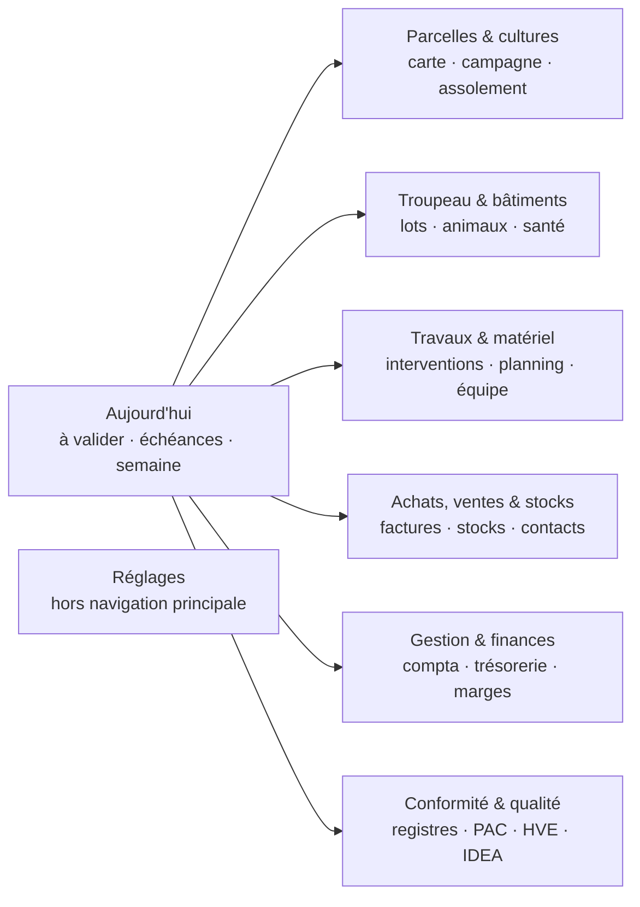
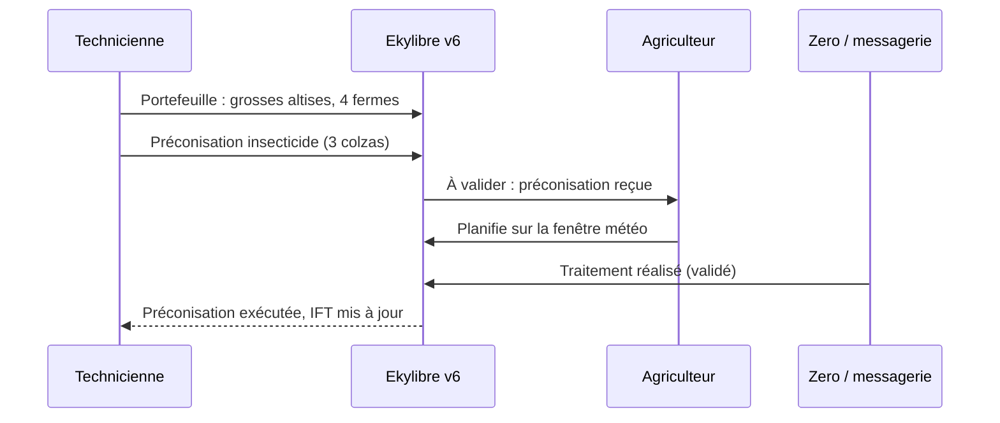

# Ekylibre V6 — Interfaces et parcours utilisateurs

**Statut :** proposition — piste visuelle B retenue
**Date :** 13 septembre 2026
**Complément de :** [v6-architecture.md](v6-architecture.md) (ADR-007, ADR-010,
ADR-011) et [v6-roadmap.md](v6-roadmap.md) (§ 12.2, lots 1 à 7). Là où
l'architecture décide qu'il y aura des « manifestes d'écran par profil métier »,
ce document dit **quels écrans, pour qui, organisés comment**, et dans quel ordre
les construire sur la pile Rails 8.1 sans casser la v5.

**Ce qui est demandé (roadmap § 12.2) :** concentrer la valeur et les
fonctionnalités dans le moins d'écrans possible, pour deux publics — les
**agriculteurs** et les **conseillers** (technicien, comptable, …) — au sein de
**thématiques** qui regroupent les fonctionnalités actuelles.

**Maquettes :** piste B « Carnet de terrain » détaillée sur huit écrans et une
planche de composants ; pistes A et C conservées pour mémoire. Voir § 10.

**Décisions prises au cadrage :** comparer trois pistes visuelles avant d'en
détailler une ; maquettes statiques ; conseiller en **portefeuille
multi-exploitations** ; quatre profils de conseillers (technicien cultures,
comptable / CER, conseiller élevage, certification / audit). Après comparaison :
**piste visuelle B retenue**.

---

## 1. Constat — l'interface v5 telle qu'on la voit

Relevé fait sur `demo.ekylibre-dev.com` (Ekylibre 5.0, compte de démonstration,
plugins Planification, Durabilité et Économique actifs) et dans le dépôt.

### 1.1 Mesures

| | Valeur | Source |
|---|---|---|
| Modules de premier niveau (cœur) | 9 | `config/navigation.xml` |
| Entrées de la barre supérieure sur la démo | 12 (les plugins en ajoutent 3) | démo |
| Groupes de menu latéral | 36 | `config/navigation.xml` |
| Entrées de menu | 103, dont **36 dans Configuration** | `config/navigation.xml` |
| Actions `#index` distinctes | 180 | `config/navigation.xml` |
| Contrôleurs backend | 335 fichiers (212 à la racine) | `app/controllers/backend` |
| Vues HAML backend | 854 | `app/views/backend` |
| Cellules de tableau de bord | 64 | `app/controllers/backend/cells` |
| Media queries propres à l'application | **0** | `app/assets/stylesheets` |
| Corps de texte / hauteur de cible | 13 px / 32 px (`$fs-normal`, `$fingertip-height`) | thème `tekyla` |

### 1.2 Ce que ces chiffres produisent à l'écran

**La navigation suit le modèle de données, pas le travail.** Tiers,
Comptabilité, Ventes, Achats, Stocks, Production, RH, Outils : c'est l'organigramme
d'un ERP. Un agriculteur qui a « traité le blé ce matin » doit savoir que cela
s'appelle une *intervention*, qu'elle vit dans *Production*, et choisir ensuite
parmi une vingtaine de familles de procédures présentées en menus déroulants.

**Trois niveaux de navigation sont visibles en permanence** — barre supérieure,
menu latéral, et sur l'accueil une grille de douze icônes qui répète la barre.
Chaque plugin ajoute une entrée de premier niveau : la navigation grossit
mécaniquement avec l'écosystème.

**Le panneau d'aide occupe environ un quart de la largeur sur toutes les
pages.** Son contenu est utile la première fois et encombrant ensuite ; il réduit
la zone de travail des listes et des cartes, qui en ont le plus besoin.

**Les tableaux de bord sont passifs.** Les cellules se chargent en asynchrone et
affichent « Aucune donnée » sans dire quoi faire ; l'accueil de la démo affiche
une erreur de clé d'API. Rien ne dit à l'utilisateur ce qu'il a *à faire*
aujourd'hui.

**L'information est dispersée par objet technique.** Une parcelle se lit à
travers *Zones cultivables*, *Parcelles*, *Cultures*, *Groupements parcellaires*,
*Interventions*, *Analyses*, *Observations* et *Déclarations PAC* — huit écrans
pour un seul objet du monde réel. La fiche tiers aligne vingt sous-listes
`list_*`.

**Les listes sont denses et peu lisibles** : 13 px, actions en icônes sans
libellé (crayon, croix), colonnes nombreuses, filtres cachés derrière un bouton.

**L'interface n'est pas utilisable sur tablette ou téléphone** (aucune media
query applicative). C'est acceptable si le terrain passe par Zero, pas si la
cabine du tracteur ou la salle de traite doivent consulter le web.

**Ce qui marche et qu'on garde :** la cartographie centrale (bascule
Liste / Carte), le sélecteur de campagne toujours visible, la fiche activité qui
réunit déjà surface, IFT, budget et coûts de production, la richesse
réglementaire (registres, IFT, PAC). La continuité visuelle (vert, Lato) a été
examinée comme piste A et écartée (§ 10.1).

---

## 2. Principes directeurs

1. **Le travail avant la structure.** On navigue par thématique métier
   (« Parcelles & cultures »), jamais par table (« Zones cultivables »).
2. **Une fiche par objet du monde réel.** Parcelle, animal ou lot, matériel,
   tiers, exploitation : tout ce qui les concerne est lisible depuis leur fiche,
   sans changer d'écran.
3. **L'accueil dit ce qu'il y a à faire.** Pas de grille d'icônes : une boîte
   « À valider », les échéances, les alertes et la semaine à venir.
4. **Saisir sans quitter son contexte.** Création et modification dans un
   tiroir latéral ; le formulaire se pré-remplit depuis l'endroit d'où l'on vient.
5. **Aucune écriture métier sans validation humaine** (ADR-007) — qu'elle vienne
   de Duke, d'une Plateforme Agréée, d'une synchronisation ou d'un conseiller.
6. **Le conseiller travaille chez l'agriculteur, avec sa permission, et cela se
   voit.** Contexte et périmètre affichés en permanence ; chaque accès est
   tracé et visible par l'agriculteur.
7. **Le profil façonne l'écran, pas le code.** Un éleveur ne voit pas de chai,
   un céréalier ne voit pas de troupeau : c'est le manifeste (ADR-011) qui en
   décide, pas une branche de vues.
8. **L'aide vient quand on la demande** — états vides qui expliquent, info-bulles,
   aide à la demande — et ne consomme pas l'écran le reste du temps.
9. **Lisible dehors, touchable avec des gants** : texte d'interface 15 px
   minimum et métadonnées jamais sous 13 px, cibles 44 px, contraste RGAA niveau
   AA, utilisable sur tablette.

---

## 3. Personas

### 3.1 Agriculteurs

Un seul persona « agriculteur » avec un **profil métier** qui adapte les
thématiques et le vocabulaire (ADR-011) :

| Profil métier | Thématiques mises en avant | Vocabulaire |
|---|---|---|
| Grandes cultures | Parcelles & cultures, Travaux & matériel | parcelle, culture, passage |
| Polyculture-élevage | + Troupeau & bâtiments | lot, ration, bâtiment |
| Élevage | Troupeau & bâtiments en tête | animal, lot, vêlage, traite |
| Viticulture | Parcelles (vigne), + thématique Chai (plugin `viti`) | îlot, cépage, cuve |
| Maraîchage / arboriculture | Parcelles & cultures, Achats-ventes (vente directe) | planche, série, verger |

Traits communs : utilise le web au bureau (soir, jours de pluie), le téléphone au
champ. Le temps passé sur l'écran est du temps non passé sur l'exploitation. Les
obligations réglementaires (registre phyto, PAC, TVA, facture électronique) sont
vécues comme une contrainte, pas comme une fonctionnalité.

**Répartition des canaux :**

| Canal | Rôle | Porté par |
|---|---|---|
| Messagerie (WhatsApp / Telegram) | déclarer vite : note vocale, photo | `voice-gateway` + Duke |
| Zero (mobile hors ligne) | saisir et consulter au champ, carte | `zero-mobile` |
| Web v6 | valider, piloter, planifier, déclarer, partager | `eky-core` (ce document) |

### 3.2 Conseillers

Le conseiller suit un **portefeuille de N exploitations**, avec leur
consentement, périmètre par périmètre (brainstorm FR-1, FR-5). Quatre profils
sont retenus pour la v6 :

| Profil | Ce qu'il cherche en ouvrant Ekylibre | Écrit quoi | Lit quoi |
|---|---|---|---|
| **Technicien cultures** | quelles parcelles de mon secteur demandent une visite ou une préconisation | préconisations (proposées) | parcelles, cultures, interventions, observations, IFT, analyses |
| **Comptable / CER** | quelles fermes ont des pièces manquantes ou une échéance | écritures, demandes de pièces | factures, paiements, trésorerie, TVA, immobilisations |
| **Conseiller élevage** | quels troupeaux ont un signal sanitaire ou zootechnique | recommandations (proposées) | animaux, lots, traitements, délais d'attente, notifications EDE |
| **Certification / audit** | quels dossiers HVE, IDEA ou bio sont incomplets | rien — lecture seule | indicateurs, registres, documents de preuve |

Une même personne peut cumuler deux profils (technicien qui audite HVE).

---

## 4. Architecture de l'information — sept thématiques

Les 9 modules, 36 groupes et 103 entrées actuels se redistribuent en **sept
thématiques** plus un espace **Réglages** sorti de la navigation principale.



**Chaque thématique a un libellé court**, affiché dans la barre d'onglets, et
un titre complet, affiché en tête de page et dans la recherche : les sept titres
complets ne tiennent pas sur une ligne à 1440 px avec un corps de 15 px.

| Titre complet | Libellé d'onglet |
|---|---|
| Aujourd'hui | Aujourd'hui |
| Parcelles & cultures | Parcelles |
| Troupeau & bâtiments | Troupeau |
| Travaux & matériel | Travaux |
| Achats, ventes & stocks | Achats & ventes |
| Gestion & finances | Gestion |
| Conformité & qualité | Conformité |

Le **profil métier** masque les thématiques sans objet (pas de *Troupeau* pour
un céréalier). Un plugin métier peut **ajouter une thématique** (Chai pour
`viti`) ou **des blocs dans une thématique existante** — jamais une entrée de
barre supérieure.

### 4.1 Correspondance avec la navigation v5

Chaque entrée actuelle a une thématique d'accueil et un sort. *Fusionné* :
l'écran disparaît au profit d'une fiche ou d'un journal. *Conservé* : l'écran
existe, restylé. *Réglages* : sort de la navigation quotidienne.

| Module v5 | Entrées v5 | Thématique v6 | Sort |
|---|---|---|---|
| Tiers | entities | Achats, ventes & stocks → **Contacts** | fiche tiers pivot ; les 20 `list_*` deviennent son journal |
| Tiers | events | Aujourd'hui (agenda) | fusionné |
| Production | cultivable_zones, land_parcels, plants, crop_groups | Parcelles & cultures | **fusionnés en une fiche parcelle** |
| Production | activities | Parcelles & cultures / Troupeau (selon famille) ; coûts dans Gestion | fiche activité conservée, enrichie |
| Production | interventions, prescriptions | Travaux & matériel | journal des travaux + saisie en tiroir ; préconisations reçues dans *À valider* |
| Production | equipments, ride_sets | Travaux & matériel | fiche matériel pivot ; trajets rattachés aux interventions |
| Production | incoming_harvests, wine_incoming_harvests | Travaux & matériel (récolte) → stocks | fusionné dans l'intervention de récolte |
| Production | animals, animal_groups | Troupeau & bâtiments | fiche lot pivot, fiche animal |
| Production | analyses, yield_observations, plant_countings, inspections | Parcelles & cultures (visibles aussi dans Conformité) | fusionnés dans le journal de la parcelle |
| Production | issues | Aujourd'hui (alertes) + fiche de l'objet | fusionné |
| Ventes | sales, opportunities, sale_contracts, subscriptions, incoming_payments, deposits | Achats, ventes & stocks → **Ventes** | un journal des ventes à facettes |
| Achats | purchase_orders, purchase_invoices, contracts, outgoing_payments, outgoing_payment_lists | Achats, ventes & stocks → **Achats** | un journal des achats ; factures reçues par PA dans *À valider* |
| Stocks | stocks, inventories, receptions, shipments, deliveries, unreceived orders | Achats, ventes & stocks → **Stocks** | stock par article + mouvements |
| Stocks | trackings | Conformité & qualité (traçabilité) | conservé |
| Stocks | building_divisions | Troupeau & bâtiments / Stocks (lieux) | fiche bâtiment |
| Comptabilité | journals, reconciliation, trial_balance, entries_ledger, general_ledger, financial_years | Gestion & finances → **Comptabilité** | conservés, mis en avant pour le profil comptable |
| Comptabilité | tax_declarations, tax_payments, fixed_assets, cashes, loans, cash_transfers | Gestion & finances | conservés ; échéances remontées dans *Aujourd'hui* |
| RH | teams, workers, worker_groups, worker_contracts, worker_time_logs | Travaux & matériel → **Équipe** | fiche personne pivot |
| RH | projects, project_tasks | Travaux & matériel (tâches) | fusionné dans le planning |
| RH | payslips, payslip_payments, payslip_contribution_payments | Gestion & finances | conservé (ne pas étendre : paie MSA hors périmètre, ADR-009) |
| Outils | documents | **transversal** : onglet Documents de chaque fiche + Conformité | fusionné |
| Outils | cap_statements | Conformité & qualité (PAC), visible depuis la parcelle | conservé |
| Outils | imports, integrations, listings | Réglages → Connexions & imports | Réglages |
| Outils | map_layers, sensors | Réglages ; données capteurs dans les fiches | Réglages |
| Configuration | 36 entrées | Réglages | Réglages, regroupées en 6 rubriques |
| Plugin Planification | modèles, itinéraires, scénarios, plan de charges, ordonnancement | Travaux & matériel (planning) ; Parcelles (assolement prévisionnel) | intégrés aux thématiques |
| Plugin Économique | coûts, marges, seuils de commercialisation | Gestion & finances → **Marges** | intégré |
| Plugin Durabilité / HVE | diagnostics IDEA, audits HVE | Conformité & qualité | intégré |

---

## 5. Modèle d'écran — six archétypes au lieu de 180 index

Aujourd'hui, chaque ressource décline `index`, `show`, `new`, `edit`. La v6 ne
connaît que **six types d'écran**, déclinés par thématique.

| # | Archétype | Rôle | Remplace |
|---|---|---|---|
| E1 | **Accueil de thématique** | carte ou liste principale + indicateurs + à-faire du thème | les tableaux de bord de module et leurs cellules |
| E2 | **Fiche pivot** | en-tête de synthèse + onglets fixes : *Synthèse · Journal · Documents · Indicateurs* | `show` + les sous-listes `list_*` + plusieurs `index` |
| E3 | **Journal** | liste unifiée, facettes, vues enregistrées, actions groupées | les `index` d'une même famille (ventes, devis, contrats, encaissements…) |
| E4 | **Tiroir de saisie** | création / modification latérale, pré-remplie par le contexte | `new` / `edit` en pleine page |
| E5 | **À valider** | toute écriture en attente d'une décision humaine | — (nouveau) |
| E6 | **Portefeuille** | vue conseiller sur N exploitations | — (nouveau) |

### 5.1 La fiche pivot (E2)

C'est l'archétype qui réduit le plus le nombre d'écrans. Cinq fiches pivots
couvrent l'essentiel de l'usage quotidien :

- **Parcelle** — géométrie, culture de la campagne, historique cultural,
  interventions, observations, analyses, IFT, déclaration PAC, documents ;
- **Lot / animal** — effectif, bâtiment, ration, traitements et délais
  d'attente, reproduction, notifications EDE ;
- **Matériel** — interventions, heures, trajets, entretien, coût d'usage ;
- **Contact** — ventes, achats, paiements, contrats, solde, échanges ;
- **Exploitation** — la fiche que voit le conseiller en entrant (§ 7.2).

L'onglet **Journal** est une chronologie filtrable qui mêle tous les objets
liés : on y lit sur une parcelle le semis, l'observation d'altises, la
préconisation du technicien, le traitement, l'analyse de terre et la facture de
semences, dans l'ordre où ils sont arrivés.

### 5.2 La boîte « À valider » (E5)

Point d'entrée unique de tout ce qui attend une décision de l'agriculteur :

| Origine | Exemple | Action proposée |
|---|---|---|
| Duke (note vocale, photo) — `pending_records` | « Anti-limaces 5 kg/ha sur le colza du Moulin » — confiance 94 % | Valider · Corriger · Rejeter |
| Plateforme Agréée (facture reçue) | Facture fournisseur 1 248,00 € | Rapprocher de la commande · Valider |
| Conseiller | Préconisation insecticide contre les grosses altises, 3 parcelles de colza | Planifier · Refuser avec commentaire |
| Comptable | Demande de pièce : relevé bancaire d'août | Déposer le document |
| Synchronisation en conflit (FR-2.5) | Surface modifiée dans Ekylibre et chez l'intégrateur | Garder l'une · Fusionner |
| Demande d'accès | La technicienne demande l'accès *Parcelles, Interventions* | Accepter · Ajuster le périmètre · Refuser |

Les éléments à confiance élevée se valident **par lot**, jamais implicitement
(ADR-007).

### 5.3 Éléments transversaux

- **Recherche et commandes** (`Ctrl+K`) : aller à une parcelle, un contact, une
  facture, ou lancer une action (« nouveau traitement »).
- **Bouton « Saisir »** toujours visible, avec entrée vocale relayée à Duke.
- **Sélecteur de campagne** conservé en tête de page.
- **Sélecteur d'exploitation** pour le conseiller (§ 7.2).
- **Aide à la demande** : un bouton ouvre le contenu actuel du panneau d'aide
  dans un tiroir ; les états vides expliquent quoi faire.

### 5.4 Inventaire cible

| Thématique | Écrans | Détail |
|---|---|---|
| Aujourd'hui | 2 | Accueil, À valider |
| Parcelles & cultures | 4 | Carte de campagne, fiche parcelle, fiche activité, assolement prévisionnel |
| Troupeau & bâtiments | 3 | Accueil troupeau, fiche lot, fiche animal |
| Travaux & matériel | 4 | Journal des travaux, planning, fiche matériel, fiche personne |
| Achats, ventes & stocks | 5 | Journal des achats, journal des ventes, stocks, fiche contact, fiche document commercial |
| Gestion & finances | 5 | Accueil, trésorerie, comptabilité, TVA et échéances, marges |
| Conformité & qualité | 3 | Registres, dossier de certification, déclaration PAC |
| Portefeuille (conseiller) | 2 | Portefeuille, fiche exploitation |
| Réglages | 6 rubriques | Exploitation, Utilisateurs & accès, Catalogue, Comptabilité, Connexions & imports, Personnalisation |

Soit **une trentaine d'écrans de travail**, plus les tiroirs de saisie. Ce
chiffre est une cible de conception ; il se vérifie thématique par thématique en
recensant les cas d'usage v5 qu'aucun écran ne couvre.

---

## 6. Parcours agriculteur

### A1 — Le point du matin (cible : 5 minutes)

1. **Aujourd'hui** : trois notes vocales envoyées la veille depuis le tracteur,
   une facture reçue, une préconisation de la technicienne.
2. Valide les deux notes à confiance élevée en un geste ; corrige la dose de la
   troisième dans le tiroir, qui montre la transcription d'origine.
3. Voit la **fenêtre de traitement** favorable demain matin (plugin météo) et
   planifie la préconisation dessus.
4. Rapproche la facture de la commande de semences : le stock et l'écriture
   comptable suivent sans ressaisie.

### A2 — Enregistrer un traitement au bureau

1. **Saisir → Traitement** (ou `Ctrl+K` « traitement »).
2. Sélectionne les parcelles **sur la carte** ; la culture et la surface se
   remplissent.
3. Choisit le produit : Lexicon fournit dose maximale, DAR, ZNT et nombre
   d'applications ; les dépassements sont signalés **pendant** la saisie, pas
   après.
4. Valide : le registre phytosanitaire, l'IFT et le coût de la parcelle sont à
   jour.

Le formulaire suit l'ordre de la pensée — *quoi, où, avec quoi, qui, quand* —
et non celui du modèle `Intervention` (paramètres, cibles, intrants, outils,
opérateurs).

### A3 — Clore une campagne

**Parcelles & cultures → Campagne** : les rendements saisis, l'assolement de
l'année suivante construit par scénarios (plugin Planification), la déclaration
PAC préparée depuis le parcellaire, puis **Gestion → Marges** par culture.

### A4 — Partager ses données avec un conseiller

1. Reçoit la demande d'accès dans **À valider**.
2. Voit qui la fait, pour quelle structure, quels périmètres (Parcelles,
   Interventions, Phyto, Élevage, Finances, Documents), en lecture ou en
   proposition, et pour combien de temps.
3. Ajuste et accepte.
4. **Réglages → Accès à mes données** : qui a consulté quoi et quand ;
   révocation en un clic (effet sous une heure, FR-1.3).

---

## 7. Parcours conseiller

### 7.1 Principe : proposer, pas écrire à la place

Tout ce qu'un conseiller écrit dans une exploitation arrive dans **À valider**
de l'agriculteur — sauf pour les périmètres où le métier impose l'écriture
directe (les écritures du comptable mandaté), qui restent tracées et visibles.



### 7.2 Le mode « chez l'exploitant »

Quand le conseiller ouvre une exploitation depuis son portefeuille :

- un **bandeau de contexte persistant**, de couleur distincte, indique
  l'exploitation, le profil sous lequel il agit et le périmètre consenti
  (« GAEC du Moulin · Technicien cultures · lecture Parcelles, Interventions ·
  proposition Préconisations ») ;
- les thématiques et actions hors périmètre sont **visibles mais inactives,
  avec la raison** (FR-6.2) plutôt que masquées : le conseiller sait ce qu'il
  pourrait demander ;
- un bouton **Revenir au portefeuille** remplace le sélecteur de campagne en tête ;
- chaque consultation alimente le journal d'accès de l'agriculteur.

### 7.3 Portefeuille par profil

Même archétype (E6), blocs différents selon le profil :

| Profil | Colonnes du portefeuille | Signaux | Vue agrégée |
|---|---|---|---|
| Technicien cultures | filières, SAU, dernière saisie, préconisations en cours | pression bioagresseurs signalée, IFT au-dessus de la référence, registre phyto incomplet | rendement et IFT par culture, cohorte |
| Comptable / CER | exercice, pièces à traiter, rapprochement bancaire, prochaine échéance TVA | factures reçues non rapprochées, relevés manquants, clôture en retard | — (pas d'agrégat financier inter-fermes par défaut) |
| Conseiller élevage | cheptel, effectif, derniers événements | délais d'attente lait en cours, notifications EDE en échec, vêlages attendus | indicateurs zootechniques de cohorte |
| Certification / audit | référentiel, date d'audit, complétude du dossier | preuves manquantes, indicateurs non calculables | niveau atteint par exploitation |

**Les agrégats respectent le seuil d'anonymisation** (FR-1.2) : une moyenne de
cohorte ne s'affiche qu'au-delà de cinq exploitations consentantes, et le
nombre est toujours indiqué.

### 7.4 Parcours par profil

**C1 — Technicien cultures, préparer une tournée.** Portefeuille → filtre
« grosses altises signalées » → quatre exploitations → carte des parcelles
concernées toutes fermes confondues → préconisation rédigée une fois,
**envoyée à plusieurs exploitations**, chacune la recevant dans son *À valider*
→ suivi de l'exécution depuis le portefeuille.

**C2 — Comptable, relancer les pièces du mois.** Portefeuille comptable trié par
pièces manquantes → exploitation → *Gestion → Pièces à traiter* : factures
reçues par PA non rapprochées, relevé bancaire absent → **demande de pièce**
envoyée (arrive dans *À valider* de l'agriculteur) → écritures, export vers
l'outil du cabinet → clôture.

**C3 — Conseiller élevage, signal sanitaire.** Portefeuille → « traitement
antibiotique, délai d'attente lait en cours » → fiche lot → vérifie le carnet
sanitaire et la notification EDE → recommandation proposée.

**C4 — Auditeur HVE, préparer un audit.** Portefeuille → dossier à 80 % →
*Conformité → Dossier HVE* : indicateurs calculés depuis les données, preuves
manquantes listées → demande des documents → export du dossier. Aucune écriture
possible.

---

## 8. Système de design

### 8.1 Partir de l'existant

Valeurs relevées dans `app/assets/stylesheets/themes/tekyla/variables.scss` et
sur la démo :

| Jeton v5 | Valeur | Décision v6 |
|---|---|---|
| Couleur de marque (barre supérieure de la démo) | `#60AD60` | **plus jamais fond de texte** : le blanc dessus donne 2,7:1, sous le seuil AA de 4,5:1. La piste B la remplace par le vert « Champ » `#3F6B3A` (blanc dessus 6,2:1) |
| `$base-color` du thème `tekyla` | `#688ED8` | abandonnée |
| `$success-color` / `$caution-color` / `$invalid-color` | `#65A907` / `#FF8811` / `#D81E08` | remplacées par les rôles Champ, Argile et Brique (§ 10.2) |
| `$desktop-background` | `#F7F7F7` | remplacé par le Papier `#F5F1E8` |
| Police | Lato, puis Open Sans | Literata et Atkinson Hyperlegible (§ 10.3) |
| `$fs-normal` | 13 px | **15 px** en corps de texte |
| `$fingertip-height` | 32 px | **44 px** pour toute cible, lignes de tableau comprises |
| `$default-border-radius` | 3 px | 4 px pour les surfaces, 22 px (pilule) pour boutons et puces |

Les jetons deviennent des **propriétés CSS personnalisées** (`--eky-color-brand`,
`--eky-space-3`, …) servies par un seul fichier, pour que le thème d'un
distributeur (Ekyagri, Ekyviti) ne soit qu'un jeu de valeurs.

### 8.2 Composants

Une bibliothèque de composants documentée, testée et **utilisable par les
plugins** :

- *structure* : coquille d'application, navigation de thématiques, bandeau de
  contexte conseiller, tiroir, onglets de fiche ;
- *données* : tableau (remplace `active_list` et `wice_grid`), journal
  chronologique, carte, indicateur, graphique ;
- *saisie* : champs avec unité, sélecteur d'objet sur carte, sélecteur de
  produit Lexicon avec contrôles réglementaires, sélecteur de période ;
- *décision* : carte « à valider » (source, confiance, trace, actions), demande
  d'accès, conflit de synchronisation ;
- *états* : vide, chargement, erreur, lecture seule avec raison.

### 8.3 Adaptation aux écrans

| Largeur | Cible | Comportement |
|---|---|---|
| ≥ 1280 px | bureau | navigation latérale dépliée, fiche + tiroir côte à côte |
| 768–1279 px | tablette, cabine | navigation repliée en icônes, tiroir en surimpression |
| < 768 px | téléphone | consultation et validation seulement ; la saisie terrain renvoie vers Zero |

### 8.4 Accessibilité

Référentiel **RGAA 4.1** : contraste AA (4,5:1 pour le texte), navigation
complète au clavier, libellés sur toutes les actions (fin des icônes seules),
annonces des mises à jour Turbo aux lecteurs d'écran, mode contraste renforcé
pour l'usage en extérieur.

---

## 9. Mise en œuvre sur la pile Rails 8.1

### 9.1 Choix techniques proposés

| Sujet | Aujourd'hui | Proposition | Lien roadmap |
|---|---|---|---|
| Navigation de pages | `turbolinks` 5.2 + correctifs jQuery | **Turbo** (Drive, Frames, Streams) | architecture § 2 « Web Hotwire » |
| Comportements | CoffeeScript, jQuery, Vue ponctuel | **Stimulus** | — |
| Composants | partiels HAML (854 vues) | **ViewComponent** + catalogue **Lookbook** (MIT) | 6.4, 7.1 |
| Actifs | Sprockets 3.7 + Webpacker 4 | **Propshaft** + `jsbundling-rails` (esbuild) pour Leaflet et ECharts | 6.4 |
| CSS | Bootstrap 3.4 + thème SCSS | jetons en propriétés CSS, sans Bootstrap | 6.4 |
| Tableaux | `active_list`, `wice_grid` | composant tableau maison | 7.1 — quitter `wice_grid` lève aussi `default_column_serializer` |
| Tiroir, mises à jour | rechargements, modales jQuery | Turbo Frames + Turbo Streams | — |
| Temps réel (À valider) | — | Turbo Streams sur Action Cable (Solid Cable après 6.3) | 6.3 |
| Écrans par profil | — | manifeste de blocs typés (§ 9.2) | 4.7, 4.8 |

Tout est open source, conformément à l'objectif § 12.1 de la roadmap.

**Gabarits des nouveaux composants : ERB dans ViewComponent.** HAML reste pour
les vues v5 non migrées. L'ERB abaisse la marche pour les contributeurs OSFarm
et pour la génération de plugins assistée (§ 12.2 de la roadmap).

### 9.2 Le manifeste d'écran (ADR-011)

Volontairement pauvre : une liste de blocs typés par thématique, déclinée par
profil métier et par rôle. Le web le rend en ViewComponent, Zero en React Native.

```yaml
# config/screens/today.yml — exemple de forme, non normatif
screen: today
blocks:
  - type: inbox            # À valider
    sources: [pending_records, received_invoices, prescriptions, access_requests]
  - type: agenda
    range: week
  - type: weather_window   # injecté par un plugin météo
    requires_plugin: sencrop
  - type: alerts
  - type: map
    layer: current_campaign
profiles:
  livestock:
    prepend: [{ type: herd_events, range: week }]
    hide: [weather_window]
roles:
  advisor_crop:
    replace_screen: portfolio
```

Vocabulaire de blocs de départ : `inbox`, `agenda`, `alerts`, `map`, `kpi`,
`chart`, `journal`, `table`, `weather_window`, `herd_events`, `shortcuts`. Un
plugin déclare de nouveaux types de blocs et les places où ils s'insèrent ; il
n'ajoute ni contrôleur de navigation ni entrée de menu.

### 9.3 Coexistence avec la v5 — migration par thématique

Réécrire 854 vues d'un coup est exclu. On procède par étranglement :

1. **Nouvelle coquille** (layout v6, navigation de thématiques, recherche,
   jetons) servie à côté de `backend`, activée **par utilisateur** avec un
   indicateur « Nouvelle interface ».
2. **Toute page v5 reste joignable depuis la coquille v6**, rendue dans le
   nouveau layout : pas d'impasse pendant la transition, et un lien « Vue
   détaillée » partout où la v6 n'a pas encore d'équivalent.
3. **Bascule thématique par thématique**, chacune livrée quand son inventaire
   de cas d'usage v5 est couvert.
4. **Les URL v5 redirigent** vers leur équivalent v6 une fois la thématique
   basculée (liens des e-mails, favoris).
5. Retrait de la coquille v5 quand plus aucune thématique n'en dépend.

### 9.4 Ordre de livraison et dépendances

| Étape | Contenu | Dépend de |
|---|---|---|
| U0 | Jetons, composants de base, coquille, recherche, catalogue Lookbook | Propshaft (6.4) ou coexistence temporaire avec Sprockets |
| U1 | **Aujourd'hui** en lecture (échéances, semaine, alertes) | U0 |
| U2 | **Parcelles & cultures** : carte de campagne, fiche parcelle, tiroir de traitement | U0 |
| U3 | **Achats** : factures reçues dans *À valider*, rapprochement | lot 5.2 — **la réception PA est déjà en retard, c'est le premier cas d'usage de la boîte** |
| U4 | **À valider** complet (Duke) | lot 3.6 (`pending_records`) |
| U5 | Travaux & matériel, Gestion & finances | U2 |
| U6 | **Portefeuille conseiller**, consentement, journal d'accès | lot 1 (requêtes inter-exploitations), lot 2 (identité Keycloak du conseiller) |
| U7 | Troupeau & bâtiments, Conformité & qualité, manifestes par profil | lot 4.7 |

U6 est la dépendance lourde : **un portefeuille multi-fermes n'est pas
constructible sur un schéma par exploitation** sans contournement coûteux. Entre
U3 et U6, un conseiller peut être invité dans une exploitation comme
utilisateur à droits restreints, avec le même bandeau de contexte : l'interface
est prête avant que le portefeuille ne le soit.

---

## 10. Piste retenue — B « Carnet de terrain »

**Canevas des maquettes :** <https://claude.ai/code/artifact/bc8948c6-ca54-4c7d-86ef-097be2d699d0>
(privé tant qu'il n'est pas partagé). Page *Piste B* : huit écrans et la planche
de jetons et composants. Page *Pistes écartées* : A et C, dans leur état du
premier tour.

Toutes les maquettes racontent **la même journée de septembre** au GAEC du
Moulin, en polyculture-élevage, vue par l'agriculteur puis par sa technicienne.
Exploitations, personnes, fournisseurs et montants sont des exemples. Les données
réglementaires (nom commercial, numéro d'AMM, dose homologuée) restent **entre
crochets** : elles viendront de Lexicon et ne doivent pas être inventées dans
une maquette.

### 10.1 Pourquoi B, et ce qu'on corrige de sa faiblesse

| | Premier tour | Décision |
|---|---|---|
| A — Continuité | reconnue par les utilisateurs v5, peu différenciante | écartée |
| **B — Carnet de terrain** | proche du vécu agricole, lisible dehors ; **la moins dense** | **retenue** |
| C — Poste de pilotage | efficace pour les conseillers, intimidante pour les agriculteurs | écartée ; sa densité survit dans la vue tableau |

La contrepartie de B — pénaliser le comptable et les listes longues — se traite
sans changer de piste : **chaque journal (E3) a deux vues, Chronologie et
Tableau**, avec les mêmes jetons. La vue Tableau garde des lignes de 44 px, le
corps de 15 px et des chiffres tabulaires ; elle devient la vue par défaut du
profil comptable (écran 5).

### 10.2 Couleurs

Les rôles comptent plus que les teintes : **le vert agit ou confirme, l'argile
demande une décision, la brique bloque, l'ardoise signale le mode conseiller.**
Une couleur n'est jamais seule porteuse de sens — toujours doublée d'un libellé
ou d'une icône.

| Rôle | Jeton | Valeur | Usage | Contraste vérifié |
|---|---|---|---|---|
| Papier | `--eky-paper` | `#F5F1E8` | fond de page | référence |
| Papier relevé | `--eky-paper-raised` | `#FBF9F3` | surfaces flottantes, champs | — |
| Encre | `--eky-ink` | `#29261F` | texte | 13,4:1 |
| Encre douce | `--eky-ink-soft` | `#4A453B` | texte long, libellés | 8,5:1 |
| Encre discrète | `--eky-ink-muted` | `#6B6457` | métadonnées | 5,2:1 |
| Filet | `--eky-rule` | `#DCD3C1` | séparateurs, décor seulement | non porteur d'information |
| Contour | `--eky-outline` | `#8A8272` | bordure des champs de saisie | 3,4:1 (seuil 3:1 des composants) |
| Champ | `--eky-action` | `#3F6B3A` | actions, sélection, conforme | 5,5:1 ; blanc dessus 6,2:1 |
| Champ foncé | `--eky-action-strong` | `#2C4E28` | survol, texte conforme | blanc dessus 9,4:1 |
| Argile | `--eky-decide` | `#A94F2A` | à décider, préconisation | 4,9:1 ; blanc dessus 5,5:1 |
| Argile foncée | `--eky-decide-text` | `#8E3F20` | texte d'attention | 6,5:1 |
| Argile claire | `--eky-decide-wash` | `#F3E3D8` | fond d'attention, entités reconnues par Duke | encre dessus 12,1:1 |
| Brique | `--eky-blocking` | `#9B2C2C` | bloquant, impayé, rejeter | 6,7:1 ; blanc dessus 7,5:1 |
| Ardoise | `--eky-advisor` | `#2F4A5A` | bandeau du mode conseiller | papier dessus 8,3:1 |
| Fond de carte | `--eky-map-ground` | `#E4E6D6` | carte | encre dessus 11,9:1 |

Contrastes calculés selon la formule WCAG 2.x, sur Papier sauf mention.

**Palette de la carte, par famille de cultures.** Aujourd'hui,
`Activity.color` lit des **noms de couleurs CSS** dans
`db/nomenclatures/colors.yml` : colza et maïs y sont tous deux `Yellow`, la
luzerne `DarkViolet` — d'où le violet saturé vu sur la démo. La v6 passe à une
palette sourde par famille, pour laisser ressortir les décisions en argile :

| Famille | Valeur |
|---|---|
| Céréales à paille | `#E7CC7C` |
| Colza, oléagineux | `#C9C66E` |
| Maïs | `#EFAE68` |
| Luzerne, légumineuses | `#B7A6C9` |
| Prairies | `#C7DDB0` |
| Sol nu, interculture | `#D9CBB0` |
| Vigne | `#B98A9C` |
| Maraîchage | `#9FB7C9` |

Le nom de chaque parcelle est écrit sur la carte : la couleur n'est jamais le
seul moyen d'identifier une culture.

### 10.3 Typographie

Deux polices sous licence **SIL OFL**, **servies par l'application** (Propshaft)
et non par le CDN de Google — souveraineté et RGPD.

| Style | Police | Taille / interligne | Usage |
|---|---|---|---|
| Titre de page | Literata 500 | 34 / 1,1 | « Lundi 14 septembre », « Parcelle du Moulin » |
| Titre de tiroir | Literata 600 | 28 / 1,1 | « Nouveau traitement » |
| Titre de section | Literata 600 | 19 / 1,3 | « À valider », « Cette semaine » |
| Repère | Literata 500 italique | 15 | jours, mois, noms sur la carte |
| Intitulé d'élément | Atkinson Hyperlegible 700 | 16 / 1,3 | titre d'une décision, d'une ligne de journal |
| Texte courant | Atkinson Hyperlegible 400 | 16 / 1,5 | phrases |
| Interface | Atkinson Hyperlegible 400 | 15 | onglets, boutons, tableaux |
| Métadonnées | Atkinson Hyperlegible 400 | 13 / 1,4 | **plancher** — rien en dessous |

Atkinson Hyperlegible est dessinée pour distinguer les caractères ambigus
(`1 l I`, `0 O`), ce qui compte pour des doses et des numéros de lot. **À
vérifier avant U0 :** la disponibilité des chiffres tabulaires
(`font-variant-numeric: tabular-nums`) ; à défaut, la version *Next* de la
police, ou une police de chiffres dédiée pour la vue Tableau.

### 10.4 Espacements, rayons, cibles

- Échelle d'espacement : 4, 8, 12, 16, 24, 32, 44 px.
- Rayons : 4 px pour les surfaces ; 22 px (pilule) pour boutons, puces et bascules.
- **Toute cible fait au moins 44 × 44 px**, lignes de tableau et liens d'action
  compris : les actions discrètes sont des boutons soulignés de 44 px de haut,
  pas des liens de 18 px.
- Élévation : une seule ombre, réservée à ce qui flotte au-dessus de la carte ou
  de la page (tiroir, cartes posées sur la carte, info-bulle).

### 10.5 Conventions de la carte

- La carte est **l'écran d'accueil**, pas un onglet : moitié gauche sur bureau.
- Les décisions à prendre portent **un numéro en pastille argile**, le même que
  dans la liste « À valider » : l'agriculteur relie la décision au lieu.
- Contour en **tirets argile** : parcelle concernée par une préconisation.
  Contour **plein vert** : parcelle sélectionnée.
- Bascule **Carte / Liste** en haut à gauche, conservée de la v5.
- Cartes flottantes (fenêtre de traitement, légende) posées **hors des
  parcelles concernées**.

### 10.6 Composants

La planche *Jetons et composants* du canevas fait référence ; elle devient le
catalogue Lookbook de U0.

| Composant | États dessinés | Règle |
|---|---|---|
| Bouton | principal, secondaire, discret, destructif, indisponible, focus clavier | un seul bouton principal par zone ; dans une liste de décisions, chaque élément est une zone |
| Onglet de thématique | actif, normal, **hors périmètre** (cadenas + info-bulle « Demander l'accès ») | hors périmètre = visible, jamais masqué |
| Filtre de journal | actif, normal | pilule de 44 px |
| Bascule de vue | Carte / Liste, Chronologie / Tableau | |
| Élément « À valider » | numéro, intitulé, source et confiance, deux actions | la confiance s'écrit en mots (« sûre à 94 % ») |
| Contrôle de saisie | conforme, attention, bloquant | tombe **pendant** la saisie, avec la conséquence chiffrée |
| Champ | normal, actif, en erreur, avec unité | l'unité est dans le champ |
| Puce d'objet | avec retrait | nom court + surface |
| Ligne de journal | date, type, intitulé, détail, source | |
| Bandeau conseiller | permanent | ardoise, 52 px, bouton « Revenir au portefeuille » |
| État vide | titre, explication, action | dit quoi faire, jamais « Aucune donnée » |

### 10.7 Écrans détaillés

| # | Écran | Archétype | Ce qu'il démontre |
|---|---|---|---|
| 1 | Aujourd'hui — agriculteur | E1 + E5 | décisions numérotées sur la carte, validation par lot des deux éléments sûrs, à surveiller, semaine |
| 2 | Vérifier une note vocale | E5 | transcription avec entités surlignées ; champ par champ, ce qui est sûr et ce qui est déduit ; alternative écartée ; effets de la validation annoncés ; **rien n'est écrit avant** (ADR-007) |
| 3 | Fiche parcelle, onglet Journal | E2 | une parcelle lue sur un écran au lieu de huit ; historique cultural ; journal filtrable |
| 4 | Tiroir de saisie : traitement | E4 | ordre *quoi, où, avec quoi, qui, quand* ; pré-remplissage depuis une préconisation ; zone non traitée de l'AMM appliquée pendant la saisie ; fenêtre météo proposée |
| 5 | Achats en vue tableau | E3 | la densité de B ; totaux ; rapprochement mis en évidence ; export pour le cabinet |
| 6 | Téléphone : valider | E5 | consulter et valider au pouce ; entrée vocale centrale ; la saisie terrain reste dans Zero |
| 7 | Portefeuille — technicienne | E6 | ce qui a changé depuis la dernière visite, en phrases ; carte des signaux ; cohorte au-dessus du seuil d'anonymisation |
| 8 | Conseillère chez l'exploitant | E2 + E4 | bandeau ardoise ; thématiques non partagées verrouillées avec raison ; préconisation envoyée comme proposition |

Le scénario tient d'un écran à l'autre. Les anti-limaces sur le colza du Moulin
passent de la note vocale (1, 2) au journal de la parcelle (3). Les grosses
altises observées donnent la préconisation de la technicienne (7, 8). Celle-ci
arrive chez l'agriculteur (1) et pré-remplit le tiroir (4). La facture de
semences reçue par la Plateforme Agréée apparaît à l'accueil (1) et dans les
achats à rapprocher (5).

### 10.8 Écriture

- **Des phrases, pas des codes** : « Anti-limaces sur le colza du Moulin »
  plutôt que « Intervention n° 4812 — molluscicide — P12 ».
- **Le temps en mots quand il est proche** (« hier, 17:32 », « mercredi »,
  « avant le 20 septembre »), en chiffres dans les tableaux.
- **Chaque chiffre avec son unité**, espace insécable avant l'unité, virgule
  décimale : « 5 kg/ha », « 3,20 ha », « 94 % ».
- **Le vouvoiement dans l'interface.** Le tutoiement n'apparaît que dans les
  messages qu'une personne écrit à une autre (écran 8).
- Les actions disent ce qui va se passer : « Planifier pour demain »,
  « Envoyer à l'exploitant », pas « OK » ni « Soumettre ».

### 10.9 Points ouverts propres à la piste

| Sujet | Échéance |
|---|---|
| Chiffres tabulaires d'Atkinson Hyperlegible, ou version *Next* | avant U0 |
| Septembre chevauche deux campagnes : colza et orge d'hiver relèvent déjà de la récolte suivante quand le maïs de l'année n'est pas ensilé. Le sélecteur global de campagne ne suffit pas ; chaque parcelle doit afficher sa campagne en cours | avant U2 |
| Mode sombre : utile en cabine la nuit ? Le papier ne se transpose pas tel quel | après les tests utilisateurs |
| Rendu de la carte : la palette sourde doit rester lisible sur fond satellite (Leaflet ou MapLibre, § 12) | avant U2 |
| Profil élevage : l'accueil carte d'abord convient-il à un éleveur hors sol ? Sinon, le manifeste remplace la carte par les bâtiments | tests utilisateurs |
| Impression des registres et du dossier d'audit dans le même langage | avant U7 |

---

## 11. Mesurer

**Avant de construire, mesurer la v5** sur les mêmes tâches, sinon aucun gain
ne sera démontrable :

| Tâche | Mesure | Cible v6 proposée |
|---|---|---|
| Enregistrer un traitement phyto (web) | temps, écrans traversés | < 90 s, 1 écran + tiroir |
| Note vocale → intervention validée | temps bout en bout | < 2 min (critère de sortie de la phase 2 de l'architecture) |
| Retrouver tout ce qui s'est passé sur une parcelle | écrans traversés | 1 (fiche parcelle) |
| Rapprocher une facture reçue | temps | < 30 s si commande existante |
| Conseiller : préparer une visite | temps, écrans | à mesurer chez 3 conseillers |
| Satisfaction | questionnaire SUS | ≥ 75 |

**Tests utilisateurs** sur les maquettes de la piste retenue, avant U0 :
cinq agriculteurs (trois filières au moins) et un conseiller par profil,
recrutés via la communauté OSFarm. Puis à chaque bascule de thématique.

---

## 12. Décisions à trancher

**Tranché le 13 septembre 2026 :** piste visuelle B « Carnet de terrain » (§ 10).

| Sujet | Échéance | Bloquant pour |
|---|---|---|
| Les sept thématiques, leurs titres et libellés courts, validés en test utilisateur | avant U1 | toute la navigation |
| Exemples de concentration d'écrans annoncés par le chef de projet (roadmap § 12.2) | avant U2 | inventaire cible § 5.4 |
| ViewComponent + ERB, ou Phlex, ou HAML 6 | avant U0 | bibliothèque de composants |
| Leaflet 1.9 ou MapLibre GL | avant U2 | carte de campagne, fiche parcelle |
| Écriture directe ou proposition, périmètre par périmètre (comptable notamment) | avant U6 | modèle de consentement |
| Seuil d'anonymisation des cohortes (5 proposé) | avant U6 | vues agrégées |
| Téléphone : consultation web ou tout dans Zero | avant U1 | § 8.3 |
| Coexistence Sprockets / Propshaft pendant U0–U2 | avant U0 | lot 6.4 |
