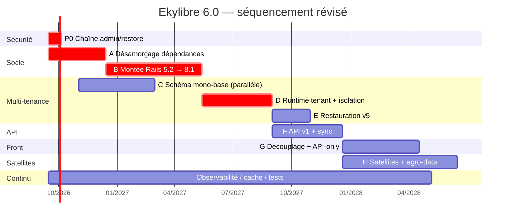

# Ekylibre 6.0 — Plan d'amélioration

> **Branche** : `ekylibre-6.0` (créée depuis `5.0-beta`, commit `f1b297cf56`)
> **Date** : 2026-09-09
> **Sources** : `ekylibre-architecture-roadmap.md` (architecture cible), `docs/planning/v6-brainstorm.md` (exigences), `docs/analysis/*` (audit 2026-05-07)
> **Statut** : plan d'exécution. Les métriques de la §1 sont mesurées sur la branche ; les efforts de la §3 sont des estimations d'ingénierie.
> **Arbitrages du 2026-09-09** : ADR-6.1 (suppression de Jasper), ADR-6.2 (remplacement d'`active_list`), ADR-6.5 (cible Rails 8.1) — cf. §5.

---

## 0. Positionnement

La roadmap d'architecture définit une **cible** (Rails 8.x API-only, mono-base PostgreSQL, `tenant_id` = nom de schéma, PK composite `(tenant_id, id)`, RLS `FORCE`) et une trajectoire en 5 phases. Ce document ne rediscute pas la cible : elle est cohérente, et elle **résout la question ouverte n°1 du brainstorm v6** (l'agrégation inter-exploitations pour les coopératives, incompatible avec le schéma-par-tenant d'Apartment).

Ce document fait trois choses que la roadmap ne fait pas :

1. **Mesurer** le coût réel de chaque phase sur le code existant.
2. **Corriger le séquencement** là où les mesures contredisent l'ordonnancement proposé.
3. **Découper en lots livrables** avec critères de sortie vérifiables.

---

## 1. Constat mesuré

### 1.1 Volumétrie

| Dimension | Mesure |
|---|---:|
| Fichiers Ruby (`app` + `lib`) | 1 572 |
| Lignes Ruby (`app` + `lib`) | 148 060 |
| Modèles | 426 fichiers — 244 racines ActiveRecord + 111 sous-classes STI |
| Contrôleurs | 410 |
| Vues HAML | 892 fichiers / 21 311 LOC |
| Helpers | 60 fichiers / 7 831 LOC |
| Services / interactors | 188 / 11 |
| Exchangers | 112 |
| Jobs | 49 |
| Tests | 834 fichiers (269 modèles, 292 contrôleurs, 71 exchangers, 43 helpers, 34 lib, 18 jobs, **1 intégration**) |
| Fixtures | 178 |
| JS legacy (`app/assets`) | 15 280 LOC / 147 fichiers |
| Migrations | 721 |

### 1.2 Base de données

| Dimension | Mesure |
|---|---:|
| Tables `public` | 240 |
| Tables `lexicon` | 73 |
| Colonnes `id integer` (int4) | **219** |
| Colonnes `id bigint` | 19 |
| Index | 1 778 (dont **35 uniques**) |
| Clés étrangères | 169 |
| Séquences | 248 |
| Vues matérialisées | 3 |
| Colonnes géométriques PostGIS | 64 |
| FK `public` → `lexicon` | **0** |

### 1.3 Couplages structurants

| Couplage | Mesure | Lecture |
|---|---:|---|
| Apartment | **9 fichiers / 33 occurrences** | Très faible. Tout transite par `Ekylibre::Tenant` (589 LOC). Levier de remplacement excellent. |
| Associations ActiveRecord | **1 413** (696 `belongs_to`, 583 `has_many`, 124 `has_one`, 10 HABTM) | Chacune devra porter `query_constraints` sous PK composite. **Poste de coût n°1 de la Phase 1.** |
| Paperclip | 6 fichiers | Faible. |
| Jasper / `rjb` / `beardley*` | 13 occurrences / 5 fichiers ; **14 templates `.jrxml`** | Faible. La voie de remplacement existe déjà : 37 `Printers::*` + `DocumentGenerator` (ODFReport + convertisseur PDF) et **154 templates `.odt`**. |
| `state_machine` (gem morte depuis 2014) | 25 usages / 10+ modèles métier | `sale`, `reception`, `shipment`, `fixed_asset`, `payslip`, `tax_declaration`… |
| `active_list` (fork Ekylibre) | 318 usages / 149 contrôleurs backend | Fortement couplé aux internes de Rails. Bloquant pour la montée. **Décidé : remplacement (ADR-6.2).** |
| SQL brut | 81 `connection.execute`, 80 `update_all`, 19 `delete_all`, 18 `select_*`, 7 `joins("…")`, 1 `find_by_sql` | Chaque site est un contournement potentiel de la RLS ou de la PK composite → à auditer. |
| API existante | 35 contrôleurs (`v1` : 20, `v2` : 15), 44 vues jbuilder, 1 serializer | Surface réelle très inférieure aux 726 routes `backend`. |

### 1.4 Chaîne de dépendances

- **152 gems déclarées**, **333 gems résolues**.
- **7 forks git Ekylibre** : `agric`, `active_list`, `possibly`, `charta`, `odf-report`, `xml_errors_parser`, `cartography`.
- **~12 gems plugins internes** : `ekylibre-banking`, `-baqio`, `-economic`, `-ednotif`, `-natuition`, `-samsys`, `-qonto`, `-traccar`, `_hve`, `_ekyviti`, `-ofx-parser`…
- Chacune doit être montée **en verrou** avec le cœur.

### 1.5 Intégration continue

- GitLab CI : `lint` (rubocop, eslint) → `build` → `test` (`bin/rails test`, couverture Cobertura).
- **Service de test : `mdillon/postgis:9.6-alpine`** — PostgreSQL 9.6, EOL depuis novembre 2021 — alors que le dev tourne sur `kartoza/postgis:13`.
- Le job de test rejoue les **721 migrations** à chaque exécution.
- Plancher de couverture (`SimpleCov.minimum_coverage`) commenté.

---

## 2. Sept écarts entre la roadmap et le code mesuré

### E1 — La montée Rails est bloquée par les gems, pas par le code applicatif

La roadmap chiffre la Phase 0 à 4–6 mois en supposant implicitement un travail réparti sur les 148 kLOC. Les mesures disent l'inverse : le code applicatif est **presque propre** vis-à-vis des API Rails retirées.

| Motif retiré par Rails | Occurrences |
|---|---:|
| `update_attributes` (retiré en 6.1) | 22 |
| `before_filter` / `skip_before_filter` (retiré en 5.1) | 1 |
| `render text:` (retiré en 5.1) | 0 |
| `Rails.application.secrets` | 0 |
| `Fixnum` / `Bignum` | 1 |
| `serialize` sans coercion (rupture Psych 4) | 14 |

Le blocage est ailleurs, dans le graphe de dépendances :

| Gem | Version | État |
|---|---|---|
| `therubyracer` | 0.12.3 | **Bloquant dur.** Abandonnée depuis 2017, `libv8` 3.16 ne compile plus sur les toolchains actuelles. |
| `state_machine` | 1.2.0 | Abandonnée depuis 2014. 25 usages sur des modèles comptables/logistiques. |
| `apartment` | 2.2.1 | Non maintenue, monkey-patchée dans `config/initializers/apartment.rb`. **Ne verrouille pas Sidekiq** : `apartment-sidekiq` déclare `sidekiq >= 2.11` sans borne haute ; le blocage vient de `gem 'sidekiq', '~> 4.0'` dans le `Gemfile`. |
| `paperclip` | 5.3.0 | Dépréciée depuis 2018. |
| `rjb` | 1.6.2 | Pont Java, sur le chemin critique de Ruby 3. |
| `webpacker` | 4.3.0 | Fin de vie. |
| `coffee-rails` | 4.2.2 | Fin de vie. |
| `sprockets` | 3.7.2 | Fin de vie. |
| `active_list` | fork ekylibre | 318 usages, couplé aux internes de Rails. |

**Conséquence sur le plan** : un lot **« désamorçage des dépendances »** doit précéder toute montée de version. Tenter `5.2 → 6.0` avec `therubyracer` et `state_machine` en place échoue au `bundle install`, pas aux tests.

### E2 — La PK composite coûte 1 413 annotations d'associations, pas quelques-unes

La roadmap mentionne `query_constraints` comme un point de vigilance. Mesuré : **1 413 déclarations d'associations** à annoter, réparties sur 426 fichiers de modèles, plus :

- **219 tables en `id integer`** à convertir en `bigint` (la cible impose une séquence globale ; `int4` plafonne à 2,1 milliards et le `setval` global de la §5.5 de la roadmap consomme l'espace d'`id` de **tous** les tenants sur une séquence unique) — chaque `ALTER TABLE … ALTER COLUMN id TYPE bigint` réécrit la table entière ;
- **169 FK** à recomposer en `(tenant_id, ref_id)` ;
- **35 index uniques** à préfixer par `tenant_id` ;
- **240 PK** à recomposer.

**Conséquence sur le plan** : ce lot doit être **mécanisé** (générateur de migrations piloté par une table de correspondance + linter de schéma en CI), jamais écrit à la main. Et il faut un **prototype de bout en bout sur 3 tables représentatives** (`interventions` + `intervention_parameters` + `products`, qui couvrent PK composite, FK composite, STI et colonne géométrique) avant d'engager les 237 autres.

### E3 — Le levier Apartment est bien meilleur que la roadmap ne le suppose

9 fichiers, 33 occurrences, tout derrière `Ekylibre::Tenant` — qui expose déjà `dump`, `restore`, `restore_v2`, `restore_v3`, `switch`, `list`, `migrate`. Le retrait d'Apartment est un travail de **quelques centaines de lignes de Ruby**, pas une réécriture.

Corollaire : `Ekylibre::Tenant.create_aggregation_views_schema!` / `drop_aggregation_schema!` (lignes 241–278) sont un contournement du schéma-par-tenant pour les requêtes inter-tenants. Ils deviennent **du code mort** dès que la mono-base est en place — c'est un gain à inscrire au bilan.

**Le risque de la Phase 1 est SQL et opérationnel, pas Ruby.**

### E4 — L'outil de restauration v5, pièce maîtresse du plan, est aujourd'hui une RCE ouverte

La roadmap fait de la restauration d'archives v5 (§5.5) à la fois le vecteur de migration **et** une capacité produit récurrente. Or, sur la branche, `Ekylibre::Tenant.restore` (`lib/ekylibre/tenant.rb:141-180`) :

1. dézippe l'archive via `system "unzip -d #{archive_path} #{archive_file}"` — argument non échappé ;
2. lit le nom du tenant dans le `manifest.yml` **contenu dans l'archive** (donc fourni par l'attaquant), ou dans `options[:tenant]` ;
3. **ne le valide pas** (le garde-fou `/\A[a-z][a-z0-9_]*\z/i` de la ligne 62 n'est appelé ni par `restore`, ni par `restore_v3`) ;
4. l'interpole dans `sh("echo '… DROP SCHEMA IF EXISTS \"#{tenant_name}\" CASCADE; …' | psql …")` (`:554-558`).

Vecteur d'entrée vérifié de bout en bout : `Admin::RestoreController#create` dérive `tenant_name` du **nom du fichier uploadé** (`File.basename(filename, '.*')`, aucune validation), le passe en variable d'environnement `TENANT` à `rake admin:restore:run`, qui appelle `Ekylibre::Tenant.restore(tenant: …)`. Le `manifest.yml` de l'archive est un second vecteur, utilisé quand `TENANT` est absent (usage CLI).

Findings de l'audit de mai **toujours ouverts** et confirmés :

- `Admin::BaseController` accepte `admin` / `admin` par défaut (`ENV.fetch('ADMIN_PASSWORD', 'admin')`) — et l'authentification HTTP Basic n'a besoin d'aucun jeton CSRF ;
- `secret_key_base` dev/test **en clair dans `config/secrets.yml`**, versionné ;
- 9 exchangers appellent `entry.extract(dest_path)` sans garde ZIP-slip — le contrôle `name_safe?` de rubyzip **ne s'applique que si `dest_path` est absent** (« the caller is responsible », dit la gem), donc il ne s'exécute jamais ici.

**Deux findings de l'audit ne tiennent pas à la vérification :**

- *« CSRF globalement désactivé »* (sec C1) est un **faux positif**. `config/application.rb:31` appelle `config.load_defaults 5.2`, ce qui active `action_controller.default_protect_from_forgery` ; le railtie d'ActionPack pose alors `protect_from_forgery with: :exception` sur `ActionController::Base`. Vérifié empiriquement sur une application minimale utilisant les gems installées : `verify_authenticity_token` est bien dans la chaîne de callbacks, stratégie `Exception`. Seul `config/environments/test.rb:29` la désactive — pratique standard. `ApplicationController` porte d'ailleurs déjà un `rescue_from ActionController::InvalidAuthenticityToken`, et les 7 layouts émettent `csrf_meta_tags`.
- *« liste blanche de `params[:id]` »* (P0.6) vise un risque **déjà couvert** : `Ekylibre::Tenant.drop` et `.dump` commencent tous deux par `raise unless exist?(name)`, et `exist?` teste l'appartenance à `Ekylibre::Tenant.list`. La liste blanche reste utile en défense en profondeur sur `dump_download` (construction de chemin), pas comme correctif.

**Conséquence sur le plan** : le durcissement de ce chemin n'est pas une tâche d'hygiène à caser plus tard, c'est le **prérequis technique du lot de restauration**. Il passe en P0.

### E5 — Il faut trois plans de données, pas deux

La roadmap décrit un plan de contrôle (`users`, `tenants`, `user_tenants`) et un plan de données (« toutes les autres tables »). Le `lexicon` (**73 tables**, référentiels agronomiques et phytosanitaires, lecture seule au runtime) n'entre dans aucun des deux : il est **partagé entre tous les tenants** et ne doit ni porter `tenant_id`, ni être sous RLS.

Bonne nouvelle mesurée : **0 FK de `public` vers `lexicon`**. La frontière est déjà propre, la séparation en trois plans est déclarative.

À trancher au même moment : les tables de frameworks (Active Storage, Solid Queue/Cable, Action Text) — la roadmap le signale, il faut y ajouter `schema_migrations` et `ar_internal_metadata`, seules tables `public` sans colonne `id`.

### E6 — L'API-only ne peut pas tenir dans la Phase 0

La roadmap place la bascule API-only dans la Phase 0, aux côtés de la montée de version. Le périmètre à supprimer ou remplacer :

- 892 vues HAML / 21 311 LOC ;
- 60 helpers / 7 831 LOC ;
- **726 routes** dans le namespace `backend` ;
- 15 280 LOC de JS legacy + 34 fichiers de packs ;
- `active_list` : 318 usages sur 149 contrôleurs ;
- 292 tests de contrôleurs, largement dépendants du rendu.

À comparer à la surface API réelle : **35 contrôleurs et 44 vues jbuilder**. Autrement dit, il faudrait construire un front de remplacement couvrant 726 routes **avant** de pouvoir basculer, à un moment où l'équipe est déjà engagée sur 8 montées de version successives.

**Conséquence sur le plan** : la Phase 0 monte Rails **en conservant le front HAML** (`api_only = false`). L'API-only devient un lot distinct, postérieur à l'API v1 et à la mise en production du front découplé. C'est le seul découpage qui laisse le produit livrable en continu.

### E7 — Les phases 0 et 1 peuvent se chevaucher

La roadmap sérialise strictement Phase 0 → Phase 1 (≈ 10 mois de chemin critique avant le premier bénéfice multi-tenant). Or :

- la **RLS ne dépend d'aucune version de Rails** — c'est du SQL, disponible depuis PostgreSQL 9.5 ;
- les migrations de schéma (`tenant_id`, `id` → `bigint`, index tenant-aware, FK composites) sont **écrivables et testables dès Rails 5.2** ;
- seule la **PK composite côté ORM** (`self.primary_key = [:tenant_id, :id]`, `query_constraints`) exige **Rails 7.1**.

**Conséquence sur le plan** : le travail de schéma (lot C) démarre en parallèle de la montée de version (lot B) et converge à l'arrivée en 7.1. Gain estimé sur le chemin critique : **3 à 4 mois**.

---

## 3. Plan révisé — lots livrables

Efforts en **jours-homme (j·h)**, hors coordination. Hypothèse : équipe de 3 à 4 développeurs.

### P0 — Fermer la chaîne d'exploitation `admin` → `restore`

**Pourquoi maintenant** : prérequis du lot E, et exposition active en production.

| # | Action | Fichier | Effort |
|---|---|---|---:|
| ~~P0.1~~ | ~~Activer `protect_from_forgery`~~ — **sans objet** : déjà actif via `load_defaults 5.2` (cf. E4) | — | 0 |
| P0.2 | Refus de démarrage si `ADMIN_USERNAME`/`ADMIN_PASSWORD` absents ou < 16 caractères ; suppression des valeurs par défaut | `admin/base_controller.rb` | 0,5 |
| P0.3 | Validation stricte du nom de tenant à **toutes** les entrées de `Ekylibre::Tenant` (dont `restore`, `restore_v2`, `restore_v3`, `dump_tables_v3`) ; `Shellwords.escape` sur tout argument shell ; `quote_ident` sur tout identifiant SQL | `lib/ekylibre/tenant.rb` | 3 |
| P0.4 | Helper anti-ZIP-slip (résolution de chemin + rejet des liens symboliques) appliqué aux 9 exchangers concernés | `app/exchangers/**` | 2 |
| P0.5 | `secret_key_base` dev/test vers l'environnement ; rotation des valeurs versionnées | `config/secrets.yml` | 0,5 |
| P0.6 | Défense en profondeur : liste blanche de `params[:id]` contre `Ekylibre::Tenant.list` dans `Admin::TenantsController` (`dump`, `dump_status`, `dump_download`) | `app/controllers/admin/` | 1 |
| P0.7 | Désactiver `noent` (XXE) dans `backup_exchanger.rb:240` ; ancrer la regex CORS (`\A…\z`, points échappés) dans `config/application.rb:75` | 2 fichiers | 0,5 |
| P0.8 | Tests de non-régression : archive ZIP-slip, archive au `manifest.yml` malveillant, nom de tenant injecté, panneau admin sans identifiants configurés | `test/` | 3 |

**Critère de sortie** : les tests du P0.8 échouent sur le commit `f1b297cf56` et passent sur `HEAD`.
**Effort : ~11 j·h — 2 semaines.**

---

### Lot A — Désamorçage des dépendances

**Objectif** : rendre le `Gemfile` compatible Ruby 3 **avant** de toucher à Rails.

| # | Action | Effort |
|---|---|---:|
| ~~A.1~~ | **FAIT** — `therubyracer` retiré. La version d'ExecJS installée ne le liste plus parmi ses runtimes et sélectionne déjà Node 20 (fourni par l'image de base, dev et prod). Pas de `mini_racer` : la gem était du poids mort, `libv8 3.16` part avec elle | 0 |
| ~~A.2~~ | **FAIT (14/14)** — sortie complète de `state_machine` via le concern maison `Transitionable` (et non AASM : le projet avait déjà choisi sa voie). 47 transitions écrites dans `app/services/<modèle>/transitions/`. Le concern a dû être étendu : méthodes d'événement définies dans un module inclus (pour que les surcharges puissent faire `super`), variantes *bang* déléguant à la méthode non-bang comme le faisait la gem, et `to_for` pour les transitions à destination variable. La gem est aussi introspectée hors des modèles — voir [l'audit](v6-dependency-audit.md) et les commits | 0 |
| ~~A.3~~ | **FAIT** — `paperclip` et `paperclip-document` retirées du `Gemfile`. 9 attachements portés sur Active Storage (`Document#file` + ses deux rendus, `Guide#reference_source`, `Import#archive`, `FinancialYearExchange#import_file`, et les 5 `has_picture`). Le stockage suit le tenant (`TenantDiskService`), donc les blobs restent dans le répertoire qu'archive `Ekylibre::Tenant.dump`. Reprise des fichiers historiques par `ImportPaperclipAttachments`, migration jouée aussi bien par `tenant:migrate` que par la restauration d'une archive ancienne, avant la suppression des 37 colonnes | 0 |
| ~~A.4~~ | **FAIT** — Jasper entièrement retiré : `rjb`, les 7 gems `beardley*`, `lib/reporting.rb`, l'initializer et les gabarits. 7 natures migrées vers `Printers::*` + ODT ; la page Exports et les agrégateurs supprimés sur arbitrage ; les 4 natures `fr_pcg*` sorties. Zéro nature sur Jasper, 43 gabarits gérés tous en `odt`. Les 7 gabarits générés restent à mettre en page. [Audit §8](v6-dependency-audit.md) | 0 |
| ~~A.5~~ | **FAIT** — `ros-apartment ~> 2.11` + `ros-apartment-sidekiq`. La série 2.11 accepte `activerecord >= 5.0, < 7.1` : elle couvre le palier actuel **et** 6.0/6.1/7.0, sans nouvelle bascule. Aucun appelant modifié (le namespace `Apartment` est conservé). Les patches ne sont **pas** supprimables — voir ci-dessous | 0 |
| ~~A.6~~ | **FAIT** — [audit des dépendances](v6-dependency-audit.md). 23 dépôts (pas 7+12) ; liste des bloquants produite par Bundler, pas déduite. Le seul « portage réel » identifié (`ekylibre-planning`) s'est révélé n'en pas être un une fois mesuré — [§3.4](v6-dependency-audit.md) ; 4 forks n'ont qu'une borne déclarative à relâcher ; 3 gems publiques ne sont que des épinglages périmés | 0 |
| A.7 | **Remplacement d'`active_list`** (ADR-6.2) — composant de liste de l'UI, à remplacer ou réécrire entièrement avec le front (lot G). Se scinde en deux : **A.7a — gel de compatibilité : FAIT** (branche `6.0`), les listes se rendent en 5.2, 6.1 et 7.0 ; **A.7b — remplacement**, toujours **bloqué par ADR-6.3** (choix du front). Le gel dispense d'y toucher pendant tout le lot B | 12 → **6** |
| ~~A.9~~ | **FAIT** — relâchement des bornes relâchables : `wice_grid ~> 4.0` → `~> 6.1` (la 6.1.3 déclare `rails >= 5.0` sans borne haute) et `deep_cloneable ~> 2.4.0` → `~> 3.0` (`activerecord >= 3.1, < 9`). Deux des neuf bloquants de Rails 6 tombent dès le palier actuel. `activerecord-postgis-adapter` et `ros-apartment` ne sont **pas** relâchables : elles montent avec chaque palier — [table de correspondance](v6-dependency-audit.md#7-relâchement-des-bornes--ce-qui-bouge-maintenant-ce-qui-bouge-avec-rails) | 0 |
| ~~A.8~~ | **FAIT** — CI entièrement sur GitHub Actions : `.gitlab-ci.yml` supprimé, ses jobs `test`, `rubocop` et `eslint` portés, PostgreSQL 13 (721 migrations vérifiées), CodeQL étendu à `5.0-beta` et `ekylibre-6.0`. **Plancher `SimpleCov` posé à 55 %** après mesure réelle sur la suite complète : **58,34 %**, et non 43 — ce chiffre venait d'une mesure faussée. **Reste hors périmètre** : PG 15+, bloqué par le `postgresql-client` 13 de l'image de base | 0 |

> **Sur A.3 — l'ordre de déploiement n'est pas négociable.** Les colonnes `<nom>_file_name` sont le seul lien restant entre une ligne et son fichier sur disque : Paperclip dérivait le chemin du modèle, pas de la base. `DropPaperclipColumns` est donc précédée dans la même série par `ImportPaperclipAttachments`, qui fait la reprise. Deux conséquences :
>
> - Sur un tenant en production, `rake tenant:migrate` suffit : reprise puis suppression, dans cet ordre. La tâche `attachments:migrate_to_active_storage` reste disponible pour un rejeu à froid ou un inventaire (`DRY_RUN=1`), tant que les colonnes existent.
> - Sur une archive antérieure (cf. `tmp/archives`), `Fixturing.migrate` rejoue la même paire de migrations depuis la version du dump. Le chemin de restauration n'a donc rien à connaître de Paperclip — c'est pourquoi le crochet qui y avait d'abord été posé a été retiré.
>
> Le chemin de Paperclip se rebâtit à partir de la **classe de l'enregistrement**, pas de sa table : l'interpolation `:class` donnait `equipments/` ou `workers/`, jamais `products/`. Vérifié sur les archives de tenants, où aucun répertoire `products/` n'existe. Les accesseurs `<nom>_file_name`, `_content_type`, `_file_size` et `_updated_at` survivent à la suppression des colonnes — `LegacyAttachmentColumns` les recalcule depuis l'attachement — ce qui évite de réécrire les vues, exchangers et impressions qui les consomment.

> **Sur A.7a — ce qui bloquait n'était pas ce qu'on croyait.** L'audit désignait `ActionView::Base.send(:class_eval, …)` comme « le seul point réellement risqué ». Mesuré sur une application Rails jetable : il fonctionne tel quel en 6.1 comme en 7.0 — les helpers définis sur `ActionView::Base` restent hérités par les sous-classes de vue que Rails 6 introduit. Trois choses bloquaient vraiment :
>
> - la borne `rails >= 3.2, < 6`, qui interdisait toute résolution au-delà de 5.2 ;
> - deux dépendances mortes, `arel` et `rubyzip`, absentes de `lib/` — `arel` étant la plus gênante, la gem ayant été fusionnée dans ActiveRecord en Rails 6 ;
> - **une rupture Ruby 3, pas Rails** : le code généré appelait `'clé'.t(…)`, et `String#t`/`Symbol#t` (i18n-complements) passent `I18n.translate(self, options)` en deux positionnels. Sous Ruby 3 toute liste levait `wrong number of arguments (given 2, expected 0..1)`, y compris sans argument. Converti en `::I18n.translate`, traductions comparées une à une.
>
> Vérifié : Rails 5.2/Ruby 2.6 sur l'application réelle (`eager_load!` compile les 298 helpers, rendu complet d'une liste à 33 730 octets), puis Rails 6.1 et 7.0 sous Ruby 3.0 (requête HTTP → 200, table rendue).
>
> Reste dans le gel, sans effet avant Ruby 3.1 : le code généré appelle `YAML::load` sur les préférences de liste, que Psych 4 refusera sans `permitted_classes`. À traiter en B.1, avec le reste de Psych.

> **Sur A.8 — la mesure de couverture était fausse, et trois blocages l'accompagnaient.** `SimpleCov.start` s'exécutait **après** `require config/environment` : Ruby n'instrumentant que ce qui est chargé ensuite, tout ce que le boot charge était compté à 0 %. Mesuré sur un seul fichier de test, `lib/ekylibre/tenant.rb` affichait 0,0 % alors qu'il s'exécute en permanence ; l'ordre corrigé, il passe à 27,1 % et la couverture globale double. Le `minimum_coverage 43` laissé en commentaire reposait donc sur ce chiffre-là.
>
> Trois obstacles ont dû tomber avant de pouvoir mesurer :
>
> - **`bin/webpack` ne compilait plus.** webpack 4 hache en MD4, qu'OpenSSL 3 refuse depuis Node 17 : `ERR_OSSL_EVP_UNSUPPORTED`. Le manifest `packs-test` restait donc vide et toute vue rendant `javascript_pack_tag :legacy` échouait — c'est la vraie cause du blocage Webpacker de longue date en test. `NODE_OPTIONS=--openssl-legacy-provider` le débloque, ajouté à la CI **et** au `docker-compose` de développement.
> - **La suite interrogeait un géocodeur en ligne.** `EntityAddress#geolocate_address` appelle Nominatim en `before_save`, avec le User-Agent d'exemple `"your contact info"` : 398 réponses « 429 Too Many Requests » sur une exécution, autant d'allers-retours réseau, et un résultat qui dépendait de l'humeur du service. Le lookup `:test` de Geocoder est activé en environnement de test — aucun test n'assert sur un géocodage.
> - **`db/tables.yml` listait encore 37 colonnes Paperclip.** Ekylibre tient sa propre description de schéma, distincte de la base, et `restfully_manageable` s'en sert pour bâtir l'action `new`. D'où 17 `UnknownAttributeError`. Retirées à la main : `rake clean:schema` régénère depuis la base de développement et y ajoutait au passage les tables des plugins.

> **Sur A.8 — la suite n'est pas verte, et la CI le dira.** Mesure du 2026-09-10 : **3 849 tests, 3 417 succès, 20 échecs, 408 erreurs, 31 minutes**. Les erreurs sont dominées par des tests de contrôleur générés (`UrlGenerationError` sur des actions sans route, gabarits qui lèvent) ; celles qui venaient de ce chantier — 17 attributs inconnus — sont corrigées. Le workflow sera donc rouge dès sa première exécution : c'est l'état réel du dépôt, qu'aucune CI ne mesurait jusqu'ici. Le plancher de couverture, lui, est un cliquet à relever au fur et à mesure de l'assainissement.

> **Sur A.7a — la rupture Ruby 3 des raccourcis i18n est corrigée dans l'application.** Le défaut trouvé dans `active_list` était le même dans `config/initializers/10-patches.rb` : `tl`, `ta`, `tn`, `th` et les deux `tc` relayaient `*args` à `I18n.translate`, qui n'accepte qu'un positionnel. **2 351 sites d'appel, dont 374 avec arguments**, tous couverts — et **aucun appel n'a été touché** : la correction est aux huit définitions. Le correctif naïf `*args, **options` était insuffisant, 27 sites passant un hash en positionnel (`:x.th(defaults)`) que Ruby 3 ne convertit plus. Équivalence vérifiée sous Ruby 2.6 sur le tenant de test (12 formes, aucune divergence) et sous Ruby 3.0 sur le code réel du correctif.
>
> **Le jumeau est corrigé aussi** : `i18n-complements` portait le même défaut dans `translate` et `localize` sur huit classes (354 appels). Forkée en branche `6.0` — sa suite passe de 12 erreurs à 0 sous Ruby 3. Le fork existant chez `ekylibre` était en retard d'une version sur rubygems : la 1.1.1 y a été rattrapée d'abord, faute de quoi la bascule aurait régressé le formatage de tout montant. [Audit §3.5](v6-dependency-audit.md)

> **Sur A.7a — `onoma` bloquait Rails 7.0, l'audit ne l'avait pas vu.** La sonde a buté sur `zeitwerk ~> 2.4.0` déclaré par `onoma`, quand Rails 7.0 exige `~> 2.5` : aucune résolution possible. La borne était déclarative — onoma n'utilise que `Zeitwerk::Loader.for_gem`, présent dans toute la série 2.x — et l'audit avait classé le dépôt en « rien à faire » sur la seule foi de sa borne `activesupport >= 4.2`. Relâchée sur une branche `6.0` publiée. L'application consomme `onoma` en gem publique (`~> 0.9.8`) : la bascule ou une publication reste à faire, mais rien ne presse — le conflit ne mord qu'au palier 7.0.

> **Sur A.3 — trois plugins écrivaient via Paperclip, tous repris.** Le retrait de Paperclip casse tout site qui *écrivait* via ses attributs ; le balayage des 23 dépôts en a trouvé trois, corrigés chacun sur une branche `6.0` publiée : `ekylibre-planning` (`ScenarioExportJob`), `ekylibre-viti` (`backend/wine_incoming_harvests_controller.rb`, registre de vendange) et `ekylibre-baqio` (`integrations/baqio/handlers/sales.rb`, facture attachée à la vente). `Gemfile.prod` consomme les trois. Les sites en *lecture* n'étaient pas concernés : `LegacyAttachmentColumns` continue de les servir.

> **Sur A.5 — les monkey-patches ne sont pas supprimables.** Le plan supposait qu'ils disparaîtraient avec le fork ; l'inverse s'est vérifié :
>
> - `connect_to_new` doit rester surchargé. En amont (ros-apartment 2.11 comme apartment 2.2.1) un schéma absent lève `ActiveRecord::StatementInvalid`, et `TenantNotFound` ne vient que du `rescue *rescuable_exceptions`. Or l'application indexe son 404 sur `TenantNotFound` (elevator `SecuredSubdomain`, `rescue_from` d'`ApplicationController`). La surcharge supprime aussi ce `rescue` fourre-tout, qui déguisait toute `ActiveRecordError` en « tenant inconnu ».
> - `PSQL_DUMP_BLACKLISTED_STATEMENTS` est désormais **gelée** en amont : les `<<` de l'ancien patch auraient levé `FrozenError` au boot. La constante est reconstruite à partir de la valeur amont (7 entrées) plus les 3 nôtres — `CREATE SCHEMA` (amont ne filtre que `CREATE SCHEMA public`) et les marqueurs `\restrict` / `\unrestrict` des dumps psql 16+.
>
> Effet de bord : `public_suffix` redescend de 5.0.3 à 4.0.7 (borne de ros-apartment). Sans impact — seul `addressable` le consomme, et il accepte `< 6.0`.

**Critère de sortie** : `bundle install` réussit sous Ruby 3.3, suite de tests verte sur Rails 5.2 + Ruby 3.3, CI sur PG 15.
**Effort restant : ~0 j·h côté lot A** (85 → 72 après les arbitrages ; A.1, A.3, A.5, A.6, A.7a et A.8 faits). Ne reste qu'A.7b — le remplacement d'`active_list` — bloqué par ADR-6.3 et chiffré au lot G. **`ekylibre-planning` est porté** — le couplage annoncé n'existait pas : voir [l'audit §3.4](v6-dependency-audit.md). **Dépendances : aucune — démarre immédiatement, en parallèle de P0.**

---

### Lot B — Montée Rails 5.2 → 8.1, front conservé

**Objectif** : sortir de l'EOL. **Pas de bascule API-only ici** (cf. E6).

**Cible retenue : Rails 8.1 (ADR-6.5).** Chemin : `5.2 → 6.0 → 6.1 → 7.0 → 7.1 → 7.2 → 8.0 → 8.1`.

| # | Action | Effort |
|---|---|---:|
| B.1 | Ruby 2.6 → 3.3. **Rails 5.2 démarre et tourne sous Ruby 2.7** (images `ruby2.7` et `ruby3.3` désormais publiques sur GHCR). L'exécution sous 2.7 a livré l'inventaire exhaustif que l'analyse statique ne pouvait pas donner — 2 ruptures bloquantes et 6 sites à mots-clés, tous corrigés. **Reste** : `Psych 4` sur 4 des 14 `serialize` (au palier B.3, le crochet n'existant pas en 5.2) et la bascule d'image | 10 → **2** |
| B.2 | 5.2 → 6.0 : Zeitwerk. ~~**Point dur** : `lib/ekylibre/plugin.rb`~~ — **le mécanisme est mort** : `plugins/` est vide, `registered_plugins` aussi, et les 19 plugins sont des Rails Engines, dont Rails 6 indexe les chemins tout seul. **Conformité de nommage faite et prouvée** : 0 écart sur 1 675 fichiers de l'application, 0 sur 229 de plugins actifs, configuration Zeitwerk écrite et vérifiée. **Reste** : la bascule de version elle-même | 20 → **8** |
| B.3 | 6.0 → 6.1 : 22 `update_attributes` → `update`, `Rails.application.credentials` | 8 |
| B.4 | 6.1 → 7.0 : asset pipeline. `active_list` étant condamné (ADR-6.2), **ne pas investir dans `propshaft`/`jsbundling`** : geler `sprockets`/`webpacker` au minimum compatible et laisser le pipeline mourir avec le front au lot G | 10 |
| B.5 | 7.0 → 7.1 : **jalon de convergence avec le lot C** (PK composites natives disponibles) | 8 |
| B.6 | 7.1 → 7.2 → 8.0 → **8.1** | 15 |
| B.7 | Sidekiq 4 → Solid Queue ; Redis → Solid Cable. Réinjection du contexte tenant dans `ApplicationJob` | 12 |
| B.8 | Devise 4.9 → version courante ; **vérifier la disponibilité réelle d'Argon2id** (`has_secure_password` reste sur bcrypt ; Argon2id passe par `devise-argon2`) — la roadmap l'annonce comme un défaut de Rails 8.2, à confirmer avant de s'y engager | 5 |
| B.9 | Montée en verrou des 23 dépôts à chaque palier. **Ramené de 30 à 6 j·h** : l'audit A.6 avait déjà écarté 12 dépôts sans rien à faire et 4 à simple borne de gemspec ; `ekylibre-planning`, qui portait le reste du chiffrage, est mesuré et porté | 6 |

> **Sur B.1 — Ruby 2.7 a trouvé ce que l'analyse statique ne voyait pas.** Un conteneur isolé sur l'image `ruby2.7`, gems reconstruites dans un volume dédié : **Rails 5.2 démarre et la suite s'exécute**. Deux ruptures bloquantes, invisibles à la lecture :
>
> - `Ekylibre::Record::SelectsAmongAll` faisait `scope = Modèle.name` puis `scope << '...'`. Or **`Module#name` rend une chaîne gelée depuis Ruby 2.7** : `FrozenError`, et le modèle `Journal` — donc toute la comptabilité — cessait de se charger. `active_list` masquait la cause derrière un `rescue` nu et rapportait « Given reflection journal seems to be invalid ».
> - `Ekylibre::Lexicon#lexicon_db_url` appelait `URI.encode`, obsolète en 2.7 et **supprimée en Ruby 3.0**. Elle échappait la chaîne une fois assemblée, ce qui laissait passer les caractères réservés : un mot de passe contenant `@` ou `:` produisait une URL que `URI.parse` ne sait pas relire. Chaque composant est désormais échappé avant assemblage — équivalence vérifiée sur la configuration réelle.
>
> Puis six sites à mots-clés, remontés par `-W:deprecated` sur le code de l'application seulement : `ActionCable.server.broadcast` (le second argument est le message, pas des options), `Printers::TrialBalancePrinter.new`, `ActiveExchanger::Base.build`, le `method_missing` du bookkeeper, et les appels `.tl(options)` / `.th(defaults)` des vues de chronologie. Enfin une constante `AUTHORIZED_COLUMNS` assignée **dans** un bloc `protect`, donc réassignée à chaque mise à jour d'immobilisation.
>
> La méthode vaut d'être notée : les avertissements de Ruby 2.7 sont noyés par les internes de Rails 5.2 — il faut filtrer sur `/app/`. C'est à ce prix qu'on obtient une liste exhaustive plutôt qu'une intuition.

> **Sur B.2 — la résolution des dépendances vers Rails 6.0 ne converge pas.** Sonde conservative (verrou conservé, seul `rails` mis à jour) : Bundler **expire après 40 minutes** sans rendre ni verrou ni conflit. Ce n'est pas un refus, c'est un graphe que le résolveur n'arrive pas à parcourir. Avant d'engager le portage, il faudra donc desserrer des contraintes une à une — `sidekiq ~> 4.0` et `sprockets < 4.0` ressortent des tentatives — et non attaquer le code d'abord. **À chiffrer à part** : ce n'est pas du Zeitwerk.

> **Sur B.2 — le point dur annoncé n'existe pas.** Le plan désignait `lib/ekylibre/plugin.rb` et sa gestion des chemins d'autoload des « 16 plugins ». Mesuré : le répertoire `plugins/` est **vide**, `Ekylibre::Plugin.registered_plugins` rend `[]`, et les 19 plugins de `Gemfile.local` sont chargés comme **Rails Engines** (`Planning::Engine`, `EkylibreBaqio::Engine`, `Ekylibre::Banking::Engine`…). Or Rails 6 agrège les chemins des engines dans le chargeur principal sans rien demander. `Ekylibre::Plugin` reste du code — environ 300 lignes — mais il n'est sur le chemin critique de rien. À décider séparément : le retirer, ou le documenter comme mécanisme alternatif.
>
> Ce qui était vraiment à faire, la conformité de nommage, est **fait et prouvé**. Zeitwerk part du fichier pour en déduire la constante, à l'inverse du chargeur classique : un contrôle statique sur les **1 675 fichiers autochargés** a relevé 21 écarts, de trois natures.
>
> | Nature | Nombre | Traitement |
> |---|---:|---|
> | Acronymes (`XML`, `JSON`, `HTML`, `CSV`, `SQL`, `DSL`, `SVF`, `GeoJSON`, `FEC`, `EBP`, `EDI`) | 12 | inflecteur **de Zeitwerk**, pas `ActiveSupport::Inflector.acronym` — ce dernier est global et changerait aussi noms de routes, clés i18n et `model_name` |
> | Fichiers non autochargeables (extensions du cœur, monkey-patches, gabarits de générateurs) | 8 | `ignore` |
> | Code mort (`lib/routing/params.rb`, jamais chargé ; un fichier de 0 octet) | 2 | supprimés |
>
> La configuration est **vérifiée, pas supposée** : le contrôle rejoué en appliquant les inflexions et exclusions déclarées rend **0 écart**. Un piège évité au passage — inflechir `version` en `VERSION` pour `lib/ekylibre/version.rb` aurait cassé `app/models/version.rb`, le modèle de la piste d'audit, l'inflecteur étant global au chargeur ; le fichier est exclu à la place.
>
> Côté plugins : **229 fichiers contrôlés, 3 écarts**. Un fichier vide dans `ekylibre-viti` (supprimé — Zeitwerk lève sur un fichier qui ne définit rien), `GeoJSONModel` dans `ekylibre-hajimari` (inflexion ajoutée), et un `InvoiceXMLExportService` dans `ekylibre-imepe`, plugin désactivé dans `Gemfile.local`.

> **Sur B.1 — la bascule de version est bloquée hors de ce dépôt.** Interrogé sur GHCR : `ruby3.3`, `ruby3.2`, `ruby3.1` et `ruby3.0` répondent 403 (inexistantes ou privées), `ruby2.7` répond 200. Passer à Ruby 3 impose donc d'abord une image dans `ekylibre/docker-base-images`. **Ruby 2.7 est disponible et c'est le palier canonique** : c'est la version qui *avertit* sur la séparation des arguments nommés au lieu de lever, et une exécution de la suite sous 2.7 donnerait la liste exhaustive des ruptures restantes plutôt que l'analyse statique menée ici.

> **Sur B.1 — ce qui a été corrigé, et comment on le sait.** Le motif fautif est toujours le même : Ruby 2 convertissait en mots-clés le hash final d'un appel, Ruby 3 ne le fait plus.
>
> | Motif | Sites | Vérification |
> |---|---:|---|
> | Raccourcis i18n `tl`/`ta`/`tn`/`th`/`tc` | 374 | équivalence sur 12 formes, Ruby 2.6 |
> | `translate`/`localize` d'`i18n-complements` | 354 | suite de la gem, 12 erreurs → 0 sous Ruby 3.0 |
> | `self.call(*args)` → `initialize(x:)` dans les services | 12 | rupture et correctif reproduits sous Ruby 3.0 |
> | Relais i18n à hash positionnel (`human_action_name`, `stl`, 2 mailers) | 4 | — |
> | `Proc.new` sans bloc (`without_output`) | 1 | `tenant_test` 4/4 avant comme après |
>
> Les API réellement retirées, elles, ne posent presque rien : sur `URI.escape`, `Fixnum`, `taint`, `File.exists?`, `$SAFE` et consorts, un seul site vivant — les autres occurrences sont en commentaire ou dans des comparaisons de chaînes.

> **Sur B.1 — Psych 4 casse 4 des 14 `serialize`, mesuré.** Sous Psych 4 (défaut à partir de Ruby 3.1), `YAML.load` applique les règles de `safe_load`. Testé sur les types réellement stockés :
>
> | Type | Psych 4 |
> |---|---|
> | Hash à clés symboles, tableaux de symboles ou de chaînes | accepté |
> | `HashWithIndifferentAccess`, `Date`, `Time`, `BigDecimal` | **refusé** (`DisallowedClass`) |
>
> `Version#item_object` et `#item_changes` sérialisent des instantanés d'attributs de modèles : ils contiennent dates, horodatages et décimaux, et sont donc certains de casser — sur la table d'audit, la plus volumineuse. Les `HashSerializer` (`specie_variety`, `additional_informations`) sont exposés au même risque selon leur contenu.
>
> Rien n'est applicable sur Rails 5.2 : le crochet `yaml_column_permitted_classes` n'existe qu'à partir de 6.1/7.0. **À traiter au palier B.3**, pas avant.

**Critère de sortie** : Rails 8.1, Ruby 3.3, CI verte, aucune dépendance EOL critique, front HAML fonctionnel.
**Effort : ~75 j·h** (125 → 118 après les arbitrages, → 100 après l'audit A.6 qui divise B.9 par 2,5, → 94 une fois `ekylibre-planning` mesuré et porté, → 87 la préparation Ruby 3 étant faite). **B.1 est désormais bloqué par une dépendance externe** : l'image de base. **Dépendance : lot A.**

---

### Lot C — Schéma mono-base (démarre en parallèle du lot B)

**Objectif** : préparer et exécuter la transformation de schéma, en SQL, indépendamment de la version de Rails.

| # | Action | Effort |
|---|---|---:|
| C.1 | **Prototype 3 tables** : `interventions`, `intervention_parameters`, `products` — `tenant_id`, PK composite, FK composite, index tenant-aware, RLS `FORCE`. Couvre PK/FK composite, STI et colonne géométrique. **Porte de sortie du lot.** | 10 |
| C.2 | Classification des **313 tables** en trois plans : contrôle (global, hors RLS) / données (tenant, RLS) / référentiel (`lexicon`, partagé). Inclut la décision sur les tables de frameworks et sur `schema_migrations` | 5 |
| C.3 | **Générateur de migrations** piloté par la classification du C.2 : `tenant_id`, `id integer → bigint` (219 tables), PK composite (240), FK composites (169), index uniques tenant-aware (35) | 15 |
| C.4 | **Linter de schéma en CI** : toute table du plan de données doit porter `tenant_id NOT NULL`, une PK composite, RLS `ENABLE` + `FORCE` et une politique `USING` + `WITH CHECK`. Échec du build sinon | 5 |
| C.5 | Exécution du générateur sur les 240 tables + reprise manuelle des cas particuliers (vues matérialisées, 64 colonnes géométriques, HABTM) | 25 |
| C.6 | Audit des **206 sites de SQL brut** (81 `execute`, 80 `update_all`, 19 `delete_all`, 18 `select_*`, 7 `joins("…")`, 1 `find_by_sql`) : chacun peut contourner la RLS ou casser sur la PK composite | 20 |
| C.7 | Rôles PostgreSQL : rôle applicatif **non-propriétaire, sans `BYPASSRLS`, non-superuser** ; rôle de maintenance distinct pour migrations et analytique inter-tenants. *(Aujourd'hui : un seul rôle `ekylibre`, propriétaire des tables — d'où la nécessité de `FORCE`.)* | 5 |
| C.8 | Plan de bascule des séquences : séquence globale par table + `setval` au-dessus du `MAX(id)` **tous tenants confondus**, automatisé et rejouable | 5 |

**Critère de sortie** : le linter C.4 passe sur les 313 tables ; le prototype C.1 démontre l'isolation.
**Effort : ~90 j·h. Dépendances : C.1→C.8 séquentiels ; les annotations ORM attendent Rails 7.1 (jalon B.5).**

---

### Lot D — Runtime tenant et preuve d'isolation

| # | Action | Effort |
|---|---|---:|
| D.1 | Plan de contrôle : `users`, `tenants` (clé = `schema_name`), `user_tenants` (appartenance N–N + rôle) | 8 |
| D.2 | `TenantRecord` (PK composite) / `ApplicationRecord` (global) / `LexiconRecord` (référentiel) ; reclassement des **244 modèles racines** + 111 STI | 15 |
| D.3 | **Annotation des 1 413 associations** en `query_constraints` — mécanisée par script, revue par domaine métier | 40 |
| D.4 | Contexte runtime : `around_action` + `set_config('app.current_tenant_id', …, true)` en transaction ; `Current.tenant` ; **fail-closed** systématique | 8 |
| D.5 | Propagation du contexte aux chemins asynchrones : Solid Queue (`tenant_id` sérialisé), Solid Cable, tâches rake, exchangers | 10 |
| D.6 | **Tests d'isolation** : pour chaque modèle du plan de données, vérifier qu'une requête sans contexte renvoie 0 ligne et qu'une requête sous tenant A ne voit jamais une ligne de B. Générés, pas écrits à la main | 15 |
| D.7 | Retrait d'Apartment (9 fichiers) ; suppression du schéma d'agrégation (`create_aggregation_views_schema!`, `drop_aggregation_schema!`) devenu inutile | 8 |
| D.8 | Vigilance pooling : `SET LOCAL` uniquement en transaction ; valider le comportement derrière PgBouncer si présent en production | 5 |

**Critère de sortie** : isolation prouvée par les tests D.6 sans aucun filtre applicatif ; Apartment absent du `Gemfile`.
**Effort : ~110 j·h. Dépendances : lots B (≥ 7.1) et C.**

---

### Lot E — Restauration d'archives v5 industrialisée

| # | Action | Effort |
|---|---|---:|
| E.1 | Importeur : lecture du `schema_name` (validé, cf. P0.3), `UPSERT` dans `tenants`, chargement table par table avec injection de `tenant_id` et **conservation des `id` d'origine** | 15 |
| E.2 | Recalage automatique des séquences globales (`setval` sur le `MAX(id)` global) intégré à l'importeur — jamais une étape manuelle | 5 |
| E.3 | Contrôles d'intégrité post-import : comptes par table, résolution des FK composites intra-tenant, validation géométrique PostGIS | 8 |
| E.4 | Idempotence et rejouabilité : reprise sur incident, import partiel détecté et repris | 8 |
| E.5 | Migration réelle : import d'un tenant de production par vague, avec réconciliation | 20 |

**Critère de sortie** : une archive v5 restaurée à l'identique (comptes et `id` inchangés), procédure rejouable, `setval` automatique.
**Effort : ~56 j·h. Dépendances : P0, lots C et D.**

---

### Lot F — API v1 et synchronisation offline-first

| # | Action | Effort |
|---|---|---:|
| F.1 | Consolidation `v1`/`v2` (35 contrôleurs) en un contrat **v1 stable et versionné** ; conventions de sérialisation homogènes (44 jbuilder + 1 serializer aujourd'hui) | 25 |
| F.2 | OAuth2 / OIDC ; jetons courts, scopes par entité (aligné sur FR-5.1 du brainstorm v6) | 20 |
| F.3 | Moteur de synchronisation pull/push pour WatermelonDB : horodatage, résolution de conflits, boîte de réception de synchro (FR-2.5) | 30 |
| F.4 | Tests de contrat consommés par `zero-mobile` et `duke` | 12 |
| F.5 | **Combler le trou d'intégration** : 1 seul test d'intégration pour 410 contrôleurs. Cible : couverture des parcours critiques (intervention, vente, écriture comptable, synchro) | 20 |

**Critère de sortie** : `zero-mobile` et `duke` consomment exclusivement l'API v1 ; tests de contrat en CI.
**Effort : ~107 j·h. Dépendances : lot D.**

---

### Lot G — Découplage front et bascule API-only

**Déplacé depuis la Phase 0 de la roadmap** (cf. E6). Ne démarre qu'une fois l'API v1 stable.

| # | Action | Effort |
|---|---|---:|
| G.1 | Cartographie des 726 routes `backend` → surface fonctionnelle à reconstruire ; priorisation par usage réel (nécessite de l'instrumentation en production) | 10 |
| G.2 | Front web découplé, module par module, avec bascule progressive par tenant (feature flag) | non chiffré — dépend de G.1 |
| G.3 | Retrait des 892 vues HAML, 60 helpers, 15 280 LOC de JS, `active_list` | 20 |
| G.4 | `config.api_only = true` | 2 |

**Critère de sortie** : aucune route `backend` servie en HTML ; `api_only = true`.
**Effort : G.1/G.3/G.4 ≈ 32 j·h + le chantier front (à cadrer séparément).**

---

### Lot H — Satellites et agro-data

Conforme aux phases 3 et 4 de la roadmap, sans écart mesuré : durcissement `zero-mobile` (synchro, OTA, observabilité), `duke` en production (SSE, garde-fous LLM, FinOps), **lexicon exposé comme service versionné** (73 tables, 64 modèles consommateurs, 0 FK entrante — le découpage est déjà propre), puis service `agro-data` (Sentinel-2/NDVI, RPG, météo).

---

### Transverse (continu)

- Observabilité : **aucun APM en production** aujourd'hui (`elastic-apm` commenté). Activer un APM et `log_min_duration_statement = 200ms` **avant** toute optimisation — sinon les hotspots de `docs/analysis/performance.md` restent des hypothèses.
- Cache : `cache_store` toujours commenté en production (`config/environments/production.rb:64`) → repli sur `:memory_store` par processus alors que Redis tourne déjà. Correction à effort quasi nul, gain immédiat.
- Dette de tests : 71 tests pour 112 exchangers, 0 test sur le namespace `admin`, 1 test d'intégration.
- Hotspots connus : `Intervention` (1 495 LOC, `after_save` déclenchant `REFRESH MATERIALIZED VIEW` sous verrou `ACCESS EXCLUSIVE`), `Ekylibre::Record::Sums` en O(N²) sur les imports, 183 appels `Onoma::*` non mémoïsés.

---

## 4. Chemin critique

**Différence avec la roadmap d'origine** : le lot C démarre pendant le lot B au lieu de l'attendre (**–3 à –4 mois** sur le chemin critique), et le lot G sort de la Phase 0 (ce qui **évite un gel produit de 12 mois**).

---

## 5. Décisions à trancher avant de coder

| # | Décision | Pourquoi maintenant | Impact si repoussée |
|---|---|---|---|
| ~~ADR-6.1~~ | **TRANCHÉE (2026-09-09) — suppression de Jasper**, mais l'estimation associée était fausse : `Printers::*` + ODT couvrent 60 natures sur 73, pas la totalité. Les 13 restantes demandent chacune un gabarit `.odt` à concevoir. La décision tient ; le coût est à réviser | — | — |
| ~~ADR-6.2~~ | **TRANCHÉE (2026-09-09) — remplacement d'`active_list`.** Le fork n'est pas porté : compatibilité minimale pendant le lot B, suppression au lot G.3. Économie : ~18 j·h de portage évités sur A.7 + B.4 | — | — |
| ADR-6.3 | Front du lot G : SPA dédiée, Hotwire, ou réutilisation de `zero-mobile` en web | **Devenue la décision structurante restante** : ADR-6.2 ayant condamné `active_list`, c'est elle qui dit vers quoi migrent les 318 listes et les 726 routes `backend` | Bloque le cadrage du lot G et le chiffrage de G.2 |
| ADR-6.4 | Périmètre tenant des tables de frameworks (Active Storage, Solid Queue/Cable, Action Text) | Doit être figé avant le générateur C.3 | Reprise de 240 migrations |
| ~~ADR-6.5~~ | **TRANCHÉE (2026-09-09) — Rails 8.1.** Lignée stable, sans attendre la 8.2 annoncée « en finalisation » par la roadmap. Les mécanismes de la cible (API-only, PK composites, RLS) sont disponibles dès 7.1 | — | — |
| ADR-6.6 | Argon2id : réellement disponible en natif, ou via `devise-argon2` | Annoncé comme un défaut de Rails 8.2 dans la roadmap — **à vérifier avant engagement** | Promesse de sécurité non tenue |
| ADR-6.7 | Partitionnement natif par `tenant_id` : dès le lot C ou plus tard | Repartitionner après coup est bien plus coûteux | Migration lourde ultérieure |
| ADR-6.8 | Horizon de compatibilité des 30+ exchangers et des 16 plugins | NFR-4 du brainstorm v6 (≥ 18 mois, valeur provisoire) | Engagement client non cadré |

---

## 6. Risques

| Risque | Probabilité | Impact | Atténuation |
|---|---|---|---|
| Le lot D (1 413 associations) déborde | Élevée | Élevé | Mécaniser ; porte de sortie sur le prototype C.1 avant d'engager la masse |
| `ALTER COLUMN id TYPE bigint` sur 219 tables → indisponibilité longue | Élevée | Élevé | Mesurer sur une copie de production ; envisager `pg_repack` ou une bascule par table |
| Un fork ou un plugin bloque un palier de Rails | Moyenne | Élevé | A.6 en premier : le tableau de décision conditionne la faisabilité du lot B |
| Rôle applicatif conservé propriétaire ou `BYPASSRLS` → l'invariant tombe silencieusement | Moyenne | Critique | C.7 + test d'isolation exécuté avec le rôle **applicatif**, pas le rôle de maintenance |
| Fuite de contexte via PgBouncer en pooling transactionnel | Moyenne | Critique | D.8 ; interdire tout `SET` hors transaction ; test dédié |
| Les 206 sites de SQL brut contournent la RLS | Élevée | Élevé | C.6 exhaustif ; règle rubocop interdisant `connection.execute` hors liste blanche |
| CI sur PostgreSQL 9.6 masque des comportements RLS/partitionnement | Certaine | Moyen | A.8 en tout début de plan |
| Gel produit pendant la montée de version | Élevée | Élevé | Front conservé au lot B ; livraison continue de valeur métier en parallèle |

---

## 7. Prochaines actions

**Semaine 1**
1. Exécuter P0.1 à P0.7 et écrire les tests d'attaque P0.8.
2. Lancer A.6 (audit des 7 forks + 12 plugins) — c'est ce tableau qui rend le lot B chiffrable.
3. Basculer la CI sur PostgreSQL 15 / PostGIS 3.3 (A.8).
4. Décommenter et configurer `cache_store` en production (gain immédiat, effort nul).

**Semaines 2–4**
5. Trancher **ADR-6.3** (choix du front) — seule décision structurante encore ouverte depuis l'arbitrage du 2026-09-09 ; elle conditionne A.7 et le cadrage du lot G.
6. Démarrer A.1 (`therubyracer`) et A.2 (`state_machine`), les deux blocages durs.
7. Lancer C.1 (prototype 3 tables) : il vaut plus que n'importe quelle estimation supplémentaire.

---

## Annexe — Correspondance avec les documents sources

| Roadmap d'architecture | Ce plan | Écart |
|---|---|---|
| Phase 0 (socle + API-only, 4–6 mois) | Lots A + B (~157 j·h) | API-only déplacé au lot G (E6) ; ajout du lot A en amont (E1) |
| Phase 1 (RLS + PK composites + restauration, 4–5 mois) | Lots C + D + E (~256 j·h) | Découpé en trois ; C parallélisé avec B (E7) ; trois plans de données au lieu de deux (E5) |
| Phase 2 (API & sync, 3–4 mois) | Lot F (~107 j·h) | Ajout de F.5 (dette d'intégration : 1 test pour 410 contrôleurs) |
| Phase 3 (satellites, 3–4 mois) | Lot H | — |
| Phase 4 (agro-data, 4–6 mois) | Lot H | — |
| — | **P0** | Nouveau : chaîne d'exploitation vérifiée ouverte sur le composant même de la Phase 1 (E4) |

| Brainstorm v6 | Statut |
|---|---|
| Question ouverte n°1 (modèle inter-tenants) | **Tranchée** par la roadmap : mono-base + `tenant_id` + RLS (option (b)) |
| FR-1 (agrégation coopérative) | Débloquée par les lots C et D |
| FR-5.1 (permissions par scopes) | Portée par F.2 |
| NFR-6 (multi-tenance) | Portée par les lots C, D, E |
| Questions 2 à 8 (sync, runtime plugins, facturation, gouvernance lexicon, méta-tenant coop, IdP, horizon de compatibilité) | **Toujours ouvertes** — hors périmètre de ce plan |
